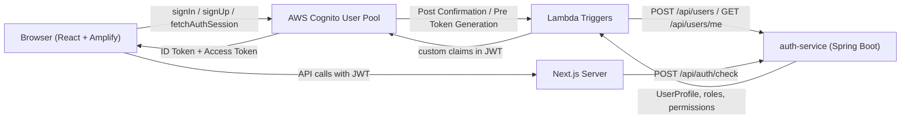
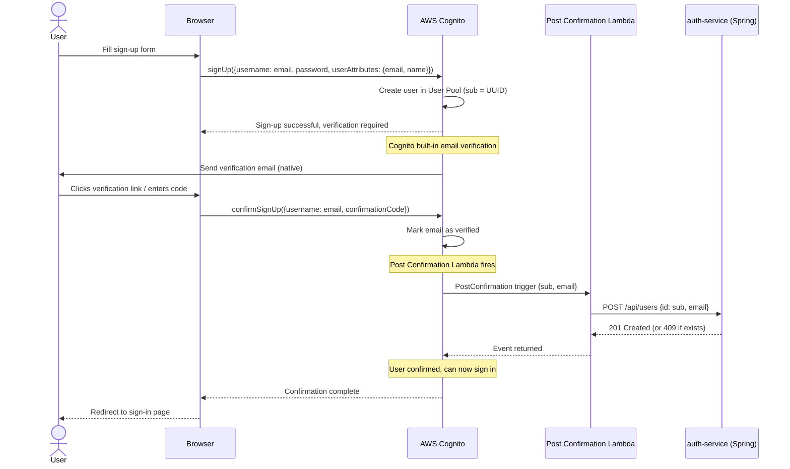
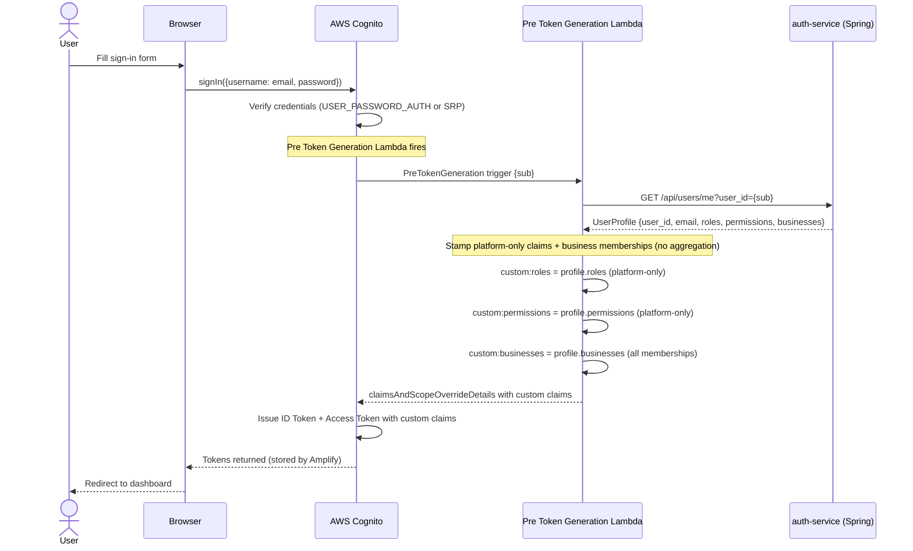
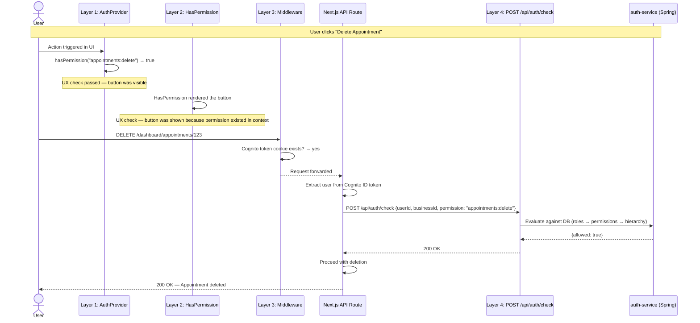

# ClinicHub Frontend Authorization Architecture — AWS Cognito + Amplify

> Prescriptive design document for implementing authentication and authorization in a ClinicHub Next.js frontend using AWS Cognito with Amplify. Covers the Cognito architecture, Lambda triggers for user provisioning and token enrichment, a four-layer frontend authorization model, and the Spring Boot auth-service integration.

---

## Table of Contents

1. [Cognito Architecture & Flow](#1-cognito-architecture--flow)
   - [1.1 High-Level Architecture](#11-high-level-architecture)
   - [1.2 Sign-Up Flow](#12-sign-up-flow)
   - [1.3 Sign-In Flow](#13-sign-in-flow)
   - [1.4 Token Enrichment (Pre Token Generation Lambda)](#14-token-enrichment-pre-token-generation-lambda)
   - [1.5 JWT Claim Structure](#15-jwt-claim-structure)
   - [1.6 Lambda Triggers](#16-lambda-triggers)
2. [Four-Layer Frontend Authorization Enforcement](#2-four-layer-frontend-authorization-enforcement)
   - [2.1 Layer Overview](#21-layer-overview)
   - [2.2 Layer 1 — AuthProvider (React Context)](#22-layer-1--authprovider-react-context)
   - [2.3 Layer 2 — Declarative Components](#23-layer-2--declarative-components)
   - [2.4 Layer 3 — Next.js Middleware](#24-layer-3--nextjs-middleware)
   - [2.5 Layer 4 — API-Level Enforcement](#25-layer-4--api-level-enforcement)
   - [2.6 Why Layers 1–3 Are UX-Only](#26-why-layers-13-are-ux-only)
   - [2.7 End-to-End Enforcement Flow](#27-end-to-end-enforcement-flow)
3. [Implementation Details](#3-implementation-details)
   - [3.1 Files to Implement](#31-files-to-implement)
   - [3.2 Spring Security Profile — `idp`](#32-spring-security-profile--idp)
   - [3.3 Environment Variables](#33-environment-variables)
4. [Risk Assessment](#4-risk-assessment)
5. [Key Design Decisions](#5-key-design-decisions)
6. [Glossary](#6-glossary)

---

## 1. Cognito Architecture & Flow

### 1.1 High-Level Architecture

The system is composed of four runtime boundaries: the browser (React SPA with Amplify), AWS Cognito (User Pool + Lambda triggers), the Next.js server (frontend hosting), and the Spring Boot auth-service. Cognito owns identity management (credential storage, email verification, password reset, token issuance), while the auth-service owns the authorization domain model (users, roles, permissions, business memberships).



**Files to implement:**

| File | Responsibility |
|---|---|
| `lib/auth-client.ts` | Amplify client — `signIn`, `signUp`, `signOut`, `fetchAuthSession` |
| `services/auth-service.ts` | HTTP client for Spring auth-service (`createUser`, `me`, `checkPermission`) |
| `middleware.ts` | Next.js edge middleware — Cognito token cookie check |
| `types/business.ts` | `BusinessContext`, `UserProfile` interfaces |
| `types/auth.ts` | `EnrichedSession`, `ParsedSessionFields` interfaces |
| `lib/auth-provider.tsx` | Layer 1 — React context providing parsed auth state and runtime aggregation |
| `components/auth/HasPermission.tsx` | Layer 2 — Declarative permission guard component |
| `components/auth/HasRole.tsx` | Layer 2 — Declarative role guard component |
| `lambda/post_confirmation.py` | Cognito Post Confirmation trigger — user provisioning |
| `lambda/pre_token_generation.py` | Cognito Pre Token Generation trigger — token enrichment |

**Files NOT needed (compared to better-auth):**

| File | Reason |
|---|---|
| `lib/auth.ts` | No server-side auth configuration needed — Cognito handles it |
| `app/api/auth/[...all]/route.ts` | No catch-all auth route — Cognito handles authentication directly |


### 1.2 Sign-Up Flow



**Key points:**
- User provisioning on the auth-service happens via the Post Confirmation Lambda, triggered automatically by Cognito after email verification.
- The `POST /api/users` call must be idempotent — a `409 Conflict` should be silently ignored.
- Email verification is handled natively by Cognito — no custom email service (Resend) is needed.
- Password reset is also handled natively by Cognito's built-in forgot password flow.

### 1.3 Sign-In Flow



**Key points:**
- Every sign-in triggers the Pre Token Generation Lambda, which fetches a fresh profile from the auth-service, ensuring roles and permissions are always current.
- The Lambda stamps platform-only roles/permissions as `custom:roles` and `custom:permissions`, and all business memberships as `custom:businesses` into the ID token.
- No aggregation happens at token time — the token carries raw, un-aggregated data. Aggregation is a downstream concern (AuthProvider or auth-service).
- If the auth-service is unreachable, the Lambda fails open — the token is issued without custom claims (user is authenticated but has no permissions).
- Cognito tokens are stateless JWTs — no server-side session table is needed.


### 1.4 Token Enrichment (Pre Token Generation Lambda)

Token enrichment is the process of decorating the Cognito ID token with authorization data from the auth-service. It runs inside the Pre Token Generation Lambda trigger, which Cognito invokes before issuing tokens on every sign-in and token refresh.

**Enrichment algorithm:**

```python
# 1. Fetch the full user profile from auth-service
profile = GET /api/users/me?user_id={sub}

# 2. Extract platform-only roles and permissions — no aggregation with business claims.
#    Aggregation is done downstream by the AuthProvider (for UI) or
#    the auth-service POST /api/auth/check (for real enforcement).
roles = profile.get("roles", [])           # e.g. ["PLATFORM_ADMIN"]
permissions = profile.get("permissions", []) # e.g. ["user:read", "user:write"]

# 3. Extract all business memberships with their own roles/permissions
businesses = profile.get("businesses", [])

# 4. Stamp into ID token claims
event["response"]["claimsAndScopeOverrideDetails"] = {
    "idTokenGeneration": {
        "claimsToAddOrOverride": {
            "custom:roles": json.dumps(roles),
            "custom:permissions": json.dumps(permissions),
            "custom:businesses": json.dumps(businesses),
        }
    }
}
```

**Why the token stores platform-only claims:**
The ID token carries platform roles/permissions as `custom:roles` and `custom:permissions`, and each business's roles/permissions nested inside `custom:businesses`. Aggregation — merging platform + active business into a single effective set — is a runtime concern that depends on which business the user has selected. This is handled by:
- The **AuthProvider** (Layer 1) on the frontend, which re-aggregates whenever `activeBusiness` changes.
- The **auth-service** (`POST /api/auth/check`, Layer 4) on the backend, which evaluates against the database.

This design means switching businesses doesn't require a new token — the frontend simply re-computes the effective set from data already in the token.

### 1.5 JWT Claim Structure

Cognito ID tokens are enriched by the Pre Token Generation Lambda with custom claims. The token structure mirrors the claim naming convention used across the platform:

```json
{
  "sub": "550e8400-e29b-41d4-a716-446655440000",
  "email": "user@example.com",
  "name": "John Doe",
  "custom:roles": ["PLATFORM_ADMIN"],
  "custom:permissions": ["user:read", "user:write"],
  "custom:businesses": [
    {
      "business_id": "b1a2c3d4-...",
      "member_id": "m5e6f7a8-...",
      "roles": ["CLINIC_OWNER"],
      "permissions": ["appointments:read", "appointments:write", "billing:read", "billing:write"]
    }
  ],
  "iss": "https://cognito-idp.{region}.amazonaws.com/{userPoolId}",
  "aud": "{appClientId}",
  "token_use": "id",
  "auth_time": 1713700000,
  "iat": 1713700000,
  "exp": 1713703600
}
```

| Claim | Type | Source |
|---|---|---|
| `sub` | `string (UUID)` | Cognito user sub (auto) |
| `email` | `string` | Cognito user attribute (auto) |
| `name` | `string` | Cognito user attribute (auto) |
| `custom:roles` | `string` (JSON-encoded `string[]`) | Platform-only roles from Pre Token Generation Lambda |
| `custom:permissions` | `string` (JSON-encoded `string[]`) | Platform-only permissions from Pre Token Generation Lambda |
| `custom:businesses` | `string` (JSON-encoded `BusinessContext[]`) | All business memberships from Pre Token Generation Lambda |
| `iss` | `string` | Cognito User Pool issuer URL (auto) |
| `aud` | `string` | App Client ID (auto) |
| `iat` | `number` | Issued-at timestamp (auto) |
| `exp` | `number` | Expiration (configurable in User Pool settings) |

The `custom:` prefix is required by Cognito for custom attributes. Custom attributes must be pre-configured in the User Pool settings (`custom:roles`, `custom:permissions`, `custom:businesses`).

Note that `custom:roles` and `custom:permissions` contain **platform-scoped** values only. Business-scoped roles and permissions live inside each entry of `custom:businesses`. The consumer (AuthProvider or downstream service) is responsible for aggregating platform + active business claims at runtime.

**Important Cognito constraint:** Custom attributes have a maximum size of 2048 bytes each. If `custom:businesses` exceeds this limit for users with many memberships, consider storing only business IDs in the claim and fetching full context client-side.

### 1.6 Lambda Triggers

#### Post Confirmation Lambda

Triggered after a user confirms their email. Provisions the user in the auth-service.

```python
# lambda/post_confirmation.py
import json
import os
from urllib import request, error

AUTH_SERVICE_URL = os.environ["AUTH_SERVICE_URL"]
AUTH_SERVICE_VERSION = "application/vnd.auth-service.v1"


def handler(event: dict, context) -> dict:
    """
    Cognito Post Confirmation trigger.
    Provisions the user in the auth-service after sign-up confirmation.
    """
    user_attrs = event["request"]["userAttributes"]
    sub = user_attrs["sub"]
    email = user_attrs["email"]

    payload = json.dumps({"id": sub, "email": email}).encode()
    req = request.Request(
        url=f"{AUTH_SERVICE_URL}/api/users",
        data=payload,
        headers={
            "Content-Type": "application/json",
            "Accept-Version": AUTH_SERVICE_VERSION,
        },
        method="POST",
    )

    try:
        request.urlopen(req)
    except error.HTTPError as e:
        # 409 Conflict is expected (idempotent) — ignore it
        if e.code != 409:
            print(f"[POST_CONFIRMATION] Failed to create user: {e.code} {e.read().decode()}")
            raise

    return event
```

#### Pre Token Generation Lambda

Triggered before Cognito issues tokens. Fetches the user profile and stamps custom claims.

```python
# lambda/pre_token_generation.py
import json
import os
from urllib import request, error

AUTH_SERVICE_URL = os.environ["AUTH_SERVICE_URL"]
AUTH_SERVICE_VERSION = "application/vnd.auth-service.v1"


def handler(event: dict, context) -> dict:
    """
    Cognito Pre Token Generation trigger.
    Fetches the user profile from the auth-service and stamps platform-only
    roles/permissions plus all business memberships as custom claims.
    No aggregation — that is done downstream by the frontend or auth-service.
    """
    sub = event["request"]["userAttributes"]["sub"]

    req = request.Request(
        url=f"{AUTH_SERVICE_URL}/api/users/me?user_id={sub}",
        headers={"Accept-Version": AUTH_SERVICE_VERSION},
        method="GET",
    )

    try:
        with request.urlopen(req) as resp:
            profile: dict = json.loads(resp.read().decode())
    except error.HTTPError as e:
        print(f"[PRE_TOKEN] Failed to fetch profile: {e.code} {e.read().decode()}")
        return event  # Fail open — token issued without custom claims

    # Platform-only roles and permissions — no business aggregation
    roles: list[str] = profile.get("roles", [])
    permissions: list[str] = profile.get("permissions", [])

    # All business memberships with their own roles/permissions
    businesses: list[dict] = profile.get("businesses", [])

    event["response"]["claimsAndScopeOverrideDetails"] = {
        "idTokenGeneration": {
            "claimsToAddOrOverride": {
                "custom:roles": json.dumps(roles),
                "custom:permissions": json.dumps(permissions),
                "custom:businesses": json.dumps(businesses),
            }
        }
    }

    return event
```

---


## 2. Four-Layer Frontend Authorization Enforcement

### 2.1 Layer Overview

| # | Layer | Where it runs | What it checks | Trust level | Purpose |
|---|---|---|---|---|---|
| 1 | **AuthProvider** (React Context) | Browser | Parsed ID token claims (roles, permissions, businesses) | None — client-side state | Provide auth context to React tree; enable conditional rendering |
| 2 | **Declarative Components** (`<HasPermission>`, `<HasRole>`) | Browser | AuthProvider context values | None — pure UI convenience | Hide/show UI elements based on permissions; reduce boilerplate |
| 3 | **Next.js Middleware** (`middleware.ts`) | Edge (server) | Cognito token cookie existence | Low — cookies can be forged | Redirect unauthenticated users; coarse route protection |
| 4 | **API-Level Enforcement** (`POST /api/auth/check`) | auth-service (Spring Boot) | Database-backed role/permission evaluation | **High — single source of truth** | **Real security boundary**; gate sensitive operations server-side |

### 2.2 Layer 1 — AuthProvider (React Context)

The `AuthProvider` must wrap the application and expose parsed authorization data to all child components. It reads claims from the Cognito ID token via Amplify's `fetchAuthSession`.

```typescript
// lib/auth-provider.tsx
"use client";

import {
  createContext,
  useContext,
  useMemo,
  useState,
  useCallback,
  useEffect,
  type ReactNode,
} from "react";
import { fetchAuthSession } from "aws-amplify/auth";
import type { BusinessContext } from "@/types/business";

export interface AuthContextValue {
  user: { id: string; email: string; name: string } | null;
  roles: string[];
  permissions: string[];
  businesses: BusinessContext[];
  activeBusiness: string;
  isAuthenticated: boolean;
  setActiveBusiness: (businessId: string) => void;
  hasPermission: (permission: string) => boolean;
  hasRole: (role: string) => boolean;
}

const AuthContext = createContext<AuthContextValue | null>(null);

export function AuthProvider({ children }: Readonly<{ children: ReactNode }>) {
  const [session, setSession] = useState<{
    user: { id: string; email: string; name: string } | null;
    roles: string[];
    permissions: string[];
    businesses: BusinessContext[];
  } | null>(null);
  const [isPending, setIsPending] = useState(true);

  useEffect(() => {
    async function loadSession() {
      try {
        const authSession = await fetchAuthSession();
        const payload = authSession.tokens?.idToken?.payload;
        if (!payload) {
          setSession(null);
          return;
        }
        setSession({
          user: {
            id: payload.sub as string,
            email: payload.email as string,
            name: (payload.name as string) ?? "",
          },
          roles: JSON.parse((payload["custom:roles"] as string) ?? "[]"),
          permissions: JSON.parse((payload["custom:permissions"] as string) ?? "[]"),
          businesses: JSON.parse((payload["custom:businesses"] as string) ?? "[]"),
        });
      } catch {
        setSession(null);
      } finally {
        setIsPending(false);
      }
    }
    loadSession();
  }, []);

  const [overrideBusinessId, setOverrideBusinessId] = useState<string | null>(null);

  const businesses = session?.businesses ?? [];
  const defaultActiveBusiness = businesses.length > 0 ? businesses[0].business_id : "";
  const activeBusinessId = overrideBusinessId ?? defaultActiveBusiness;

  // Aggregate platform + active business roles/permissions at runtime.
  // The token stores platform-only claims; business claims live in session.businesses.
  const aggregated = useMemo(() => {
    const platformRoles = session?.roles ?? [];
    const platformPermissions = session?.permissions ?? [];
    const activeBiz = businesses.find(
      (b) => b.business_id === activeBusinessId
    );
    const roles = [...platformRoles, ...(activeBiz?.roles ?? [])];
    const permissions = [...platformPermissions, ...(activeBiz?.permissions ?? [])];
    return { roles, permissions };
  }, [session, businesses, activeBusinessId]);

  const hasPermission = useCallback(
    (permission: string) => aggregated.permissions.includes(permission),
    [aggregated.permissions]
  );

  const hasRole = useCallback(
    (role: string) => aggregated.roles.includes(role),
    [aggregated.roles]
  );

  const setActiveBusiness = useCallback((businessId: string) => {
    setOverrideBusinessId(businessId);
  }, []);

  const value: AuthContextValue = useMemo(
    () => ({
      user: session?.user ?? null,
      roles: aggregated.roles,
      permissions: aggregated.permissions,
      businesses,
      activeBusiness: activeBusinessId,
      isAuthenticated: !!session?.user,
      setActiveBusiness,
      hasPermission,
      hasRole,
    }),
    [session, aggregated, businesses, activeBusinessId, setActiveBusiness, hasPermission, hasRole]
  );

  if (isPending) return null;

  return <AuthContext.Provider value={value}>{children}</AuthContext.Provider>;
}

export function useAuth(): AuthContextValue {
  const ctx = useContext(AuthContext);
  if (!ctx) throw new Error("useAuth must be used within <AuthProvider>");
  return ctx;
}
```


### 2.3 Layer 2 — Declarative Components

These components consume the `AuthProvider` context and conditionally render children. They are pure UI convenience — they must never enforce security.

```typescript
// components/auth/HasPermission.tsx
"use client";

import { useAuth } from "@/lib/auth-provider";
import type { ReactNode } from "react";

interface RequirePermissionProps {
  permission: string | string[];
  operator?: "every" | "some";
  fallback?: ReactNode;
  children: ReactNode;
}

export function HasPermission({
  permission,
  operator = "every",
  fallback = null,
  children,
}: RequirePermissionProps) {
  const { hasPermission } = useAuth();
  const perms = Array.isArray(permission) ? permission : [permission];
  const granted = operator === "every"
    ? perms.every(hasPermission)
    : perms.some(hasPermission);
  return granted ? <>{children}</> : <>{fallback}</>;
}
```

```typescript
// components/auth/HasRole.tsx
"use client";

import { useAuth } from "@/lib/auth-provider";
import type { ReactNode } from "react";

interface RequireRoleProps {
  role: string | string[];
  operator?: "every" | "some";
  fallback?: ReactNode;
  children: ReactNode;
}

export function HasRole({
  role,
  operator = "every",
  fallback = null,
  children,
}: RequireRoleProps) {
  const { hasRole } = useAuth();
  const roles = Array.isArray(role) ? role : [role];
  const granted = operator === "every"
    ? roles.every(hasRole)
    : roles.some(hasRole);
  return granted ? <>{children}</> : <>{fallback}</>;
}
```

**Usage examples:**

```tsx
{/* Single permission */}
<HasPermission permission="appointments:write">
  <button onClick={handleDeleteAppointment}>Delete Appointment</button>
</HasPermission>

{/* All required (default operator="every") */}
<HasPermission permission={["appointments:read", "appointments:write"]}>
  <AppointmentEditor />
</HasPermission>

{/* Any one suffices */}
<HasPermission permission={["billing:read", "billing:manage"]} operator="some">
  <BillingDashboard />
</HasPermission>

{/* Single role */}
<HasRole role="CLINIC_OWNER" fallback={<p>Owner access required.</p>}>
  <ClinicSettingsPanel />
</HasRole>

{/* Any of these roles */}
<HasRole role={["CLINIC_OWNER", "PLATFORM_ADMIN"]} operator="some">
  <AdminPanel />
</HasRole>
```

### 2.4 Layer 3 — Next.js Middleware

The middleware (`middleware.ts`) must check for the presence of a Cognito token cookie:

```typescript
// middleware.ts
import { NextRequest, NextResponse } from "next/server";

export function middleware(req: NextRequest) {
  // Cognito stores tokens in cookies when using Amplify SSR
  // The cookie name follows the pattern: CognitoIdentityServiceProvider.<clientId>.<sub>.idToken
  const cognitoCookie = req.cookies.getAll().find((c) =>
    c.name.includes("CognitoIdentityServiceProvider") && c.name.endsWith(".idToken")
  );

  if (!cognitoCookie) {
    return NextResponse.redirect(new URL("/signin", req.url));
  }

  return NextResponse.next();
}

export const config = {
  matcher: ["/dashboard/:path*"],
};
```

**Note:** Cookie-based checks are UX-only — not a security boundary. Cognito tokens in cookies could be expired or tampered with. Real enforcement happens at Layer 4 (auth-service).

### 2.5 Layer 4 — API-Level Enforcement (The Real Guard)

This is the only layer that provides actual security. The Spring auth-service exposes `POST /api/auth/check` which evaluates permissions against the database. The Next.js frontend must call this endpoint server-side before performing any sensitive operation.

**API contract** (from `openapi.yaml`):

```typescript
// Request
interface AuthCheckRequest {
  userId: string;      // UUID — required
  businessId?: string; // UUID — optional, for business-scoped checks
  permission: string;  // resource:action format, e.g. "appointments:delete"
}

// Response
interface AuthCheckResponse {
  allowed: boolean;
}
```

**Server-side usage** (Next.js API route or Server Component):

```typescript
// services/auth-service.ts
export async function checkPermission(
  userId: string,
  permission: string,
  businessId?: string
): Promise<boolean> {
  const response = await fetch(`${AUTH_SERVICE_URL}/api/auth/check`, {
    method: "POST",
    headers,
    body: JSON.stringify({
      userId,
      permission,
      ...(businessId ? { businessId } : {}),
    }),
  });
  if (!response.ok) return false;
  const data: { allowed: boolean } = await response.json();
  return data.allowed;
}
```

```typescript
// app/api/appointments/[id]/route.ts (example usage)
import { fetchAuthSession } from "aws-amplify/auth";
import { checkPermission } from "@/services/auth-service";
import { NextRequest, NextResponse } from "next/server";

export async function DELETE(req: NextRequest, { params }: { params: { id: string } }) {
  // Extract user from Cognito token
  const session = await fetchAuthSession();
  const payload = session.tokens?.idToken?.payload;
  if (!payload?.sub) {
    return NextResponse.json({ error: "Unauthorized" }, { status: 401 });
  }

  const userId = payload.sub as string;
  const businesses = JSON.parse((payload["custom:businesses"] as string) ?? "[]");
  const activeBusiness = businesses.length > 0 ? businesses[0].business_id : undefined;

  const allowed = await checkPermission(
    userId,
    "appointments:delete",
    activeBusiness,
  );

  if (!allowed) {
    return NextResponse.json({ error: "Forbidden" }, { status: 403 });
  }

  // ... proceed with deletion
}
```


### 2.6 Why Layers 1–3 Are UX-Only

| Concern | Layers 1–3 | Layer 4 |
|---|---|---|
| **Data source** | Cognito ID token claims / client-side state | auth-service database (PostgreSQL) |
| **Can be tampered with?** | Yes — tokens can be expired, JS state can be manipulated via devtools | No — server-side evaluation against the DB |
| **Can be stale?** | Yes — token enrichment only runs on sign-in and token refresh | No — evaluates current DB state on every call |
| **Runs where?** | Browser (L1, L2) or Edge (L3) | Spring Boot server |
| **Purpose** | Fast UX decisions: hide buttons, redirect early, show/hide sections | Enforce authorization before mutating data |

**The rule is simple:** Layers 1–3 prevent users from seeing things they shouldn't. Layer 4 prevents users from doing things they shouldn't. Never trust the frontend for security.

### 2.7 End-to-End Enforcement Flow

This diagram shows how a sensitive action ("delete appointment") passes through all four layers:



If the user had tampered with their token claims to include `appointments:delete` but didn't actually have that permission in the database, Layers 1–3 would pass but Layer 4 would return `{allowed: false}` and the API route would respond with `403 Forbidden`.

---

## 3. Implementation Details

### 3.1 Files to Implement

**`lib/auth-client.ts` — Amplify client:**

```typescript
// lib/auth-client.ts
import { Amplify } from "aws-amplify";
import {
  signIn as cognitoSignIn,
  signUp as cognitoSignUp,
  signOut as cognitoSignOut,
  getCurrentUser,
  fetchAuthSession,
} from "aws-amplify/auth";

Amplify.configure({
  Auth: {
    Cognito: {
      userPoolId: process.env.NEXT_PUBLIC_COGNITO_USER_POOL_ID!,
      userPoolClientId: process.env.NEXT_PUBLIC_COGNITO_CLIENT_ID!,
    },
  },
});

export async function signIn(email: string, password: string) {
  return cognitoSignIn({ username: email, password });
}

export async function signUp(email: string, password: string, name: string) {
  return cognitoSignUp({
    username: email,
    password,
    options: { userAttributes: { email, name } },
  });
}

export async function signOut() {
  return cognitoSignOut();
}

export async function getSession() {
  const session = await fetchAuthSession();
  if (!session.tokens?.idToken) return null;

  const payload = session.tokens.idToken.payload;
  return {
    user: {
      id: payload.sub as string,
      email: payload.email as string,
      name: (payload.name as string) ?? "",
    },
    roles: JSON.parse((payload["custom:roles"] as string) ?? "[]"),
    permissions: JSON.parse((payload["custom:permissions"] as string) ?? "[]"),
    businesses: JSON.parse((payload["custom:businesses"] as string) ?? "[]"),
  };
}

// React hook (replaces useSession from better-auth)
export { useAuthenticator as useSession } from "@aws-amplify/ui-react";
```

**TypeScript types (shared with better-auth — same data shape):**

```typescript
// types/auth.ts — parsed form for application use
interface ParsedSessionFields {
  roles: string[];
  permissions: string[];
  businesses: BusinessContext[];
  activeBusiness: string;
}
```

### 3.2 Spring Security Profile — `idp`

The Spring auth-service must use the `idp` profile for Cognito JWT validation:

```yaml
# application.yml (Spring Boot)
spring:
  profiles:
    active: ${SPRING_PROFILES_ACTIVE:idp}

---
spring.config.activate.on-profile: idp
spring.security.oauth2.resourceserver:
  jwt:
    issuer-uri: https://cognito-idp.${AWS_REGION}.amazonaws.com/${COGNITO_USER_POOL_ID}
    jwk-set-uri: https://cognito-idp.${AWS_REGION}.amazonaws.com/${COGNITO_USER_POOL_ID}/.well-known/jwks.json
```

This enables `JwtIssuerAuthenticationManagerResolver` for Cognito issuer URL validation. No code changes are required in the auth-service — only the profile switch.

### 3.3 Environment Variables

| Variable | Description | Example |
|---|---|---|
| `NEXT_PUBLIC_COGNITO_USER_POOL_ID` | Cognito User Pool ID | `us-east-1_AbCdEfGhI` |
| `NEXT_PUBLIC_COGNITO_CLIENT_ID` | Cognito App Client ID | `1a2b3c4d5e6f7g8h9i0j` |
| `AUTH_SERVICE_URL` | Spring auth-service base URL (Lambda env) | `https://auth.clinichub.internal` |
| `AWS_REGION` | AWS region for Cognito (Spring env) | `us-east-1` |
| `COGNITO_USER_POOL_ID` | User Pool ID (Spring env) | `us-east-1_AbCdEfGhI` |

**Cognito User Pool configuration requirements:**
- Custom attributes: `custom:roles`, `custom:permissions`, `custom:businesses` (all string type, max 2048 bytes)
- Email verification: enabled (built-in)
- Password policy: configured per organizational requirements
- Lambda triggers: Post Confirmation → `post_confirmation.py`, Pre Token Generation → `pre_token_generation.py`

---

## 4. Risk Assessment

| Risk | Likelihood | Impact | Mitigation |
|---|---|---|---|
| Pre Token Generation Lambda latency adds to sign-in time | Medium | Medium | Lambda is invoked synchronously. Keep it warm with provisioned concurrency. Target < 200ms. |
| Cognito custom attribute limits (max 50, max 2048 bytes per attribute) | Low | High | `custom:businesses` could exceed 2048 bytes for users with many memberships. Mitigation: store only business IDs in the claim, fetch full context client-side. |
| Cognito token refresh doesn't re-trigger Pre Token Generation | Medium | Medium | Stale claims until next full sign-in. Mitigation: set short ID token TTL (15min) or use access token + API calls. |
| Amplify SSR cookie handling differs across frameworks | Medium | Low | Test middleware thoroughly. Amplify v6 has improved SSR support with `fetchAuthSession({ forceRefresh: false })`. |
| Team unfamiliarity with Lambda triggers | Low | Low | Lambda code is minimal (< 50 lines each). Provide runbooks and local testing with `sam local invoke`. |

---

## 5. Key Design Decisions

| Decision | Rationale |
|---|---|
| **Token enrichment via Pre Token Generation Lambda** | Cognito's native mechanism for stamping custom claims into JWTs. Runs on every sign-in, ensuring roles and permissions are current. |
| **`custom:` prefix on JWT claims** | Required by Cognito for custom attributes. Matches the naming convention used across the platform. |
| **Four-layer authorization model** | Defense in depth. Layers 1–3 provide fast UX feedback. Layer 4 provides real security. This separation means frontend developers can build responsive UIs without worrying about security, while backend enforcement is never bypassed. |
| **auth-service as the single source of truth** | All authorization decisions ultimately resolve to the auth-service database. Cognito is an identity provider only — it does not own the authorization model. This makes the identity provider swappable. |
| **Stateless sessions (JWT-only)** | Cognito uses stateless JWTs — no server-side session table is needed. This simplifies infrastructure and improves scalability. |
| **First business as default activeBusiness** | Simple heuristic for MVP. Future enhancement: persist the user's last-selected business and restore it on sign-in. |
| **No aggregation at token time** | The ID token stores platform-only roles/permissions as `custom:roles`/`custom:permissions`, with business-scoped claims nested inside `custom:businesses`. Aggregation (platform + active business) is a runtime concern handled by the AuthProvider (frontend) or `POST /api/auth/check` (backend). This means switching businesses doesn't require a new token — the frontend re-computes the effective set from data already present. |
| **Fail-open on Lambda errors** | If the Pre Token Generation Lambda cannot reach the auth-service, the token is issued without custom claims. The user is authenticated but has no permissions. Layer 4 enforcement still blocks unauthorized actions. |
| **Native email verification and password reset** | Cognito handles email verification and forgot-password flows natively — no custom email service (Resend) is needed, reducing operational complexity. |

---

## 6. Glossary

| Term | Definition |
|---|---|
| **Platform roles** | Roles scoped to the entire ClinicHub platform (e.g., `PLATFORM_ADMIN`, `SUPPORT_AGENT`). Assigned directly to a user via `POST /api/users/{userId}/roles`. Apply regardless of which business is active. |
| **Business roles** | Roles scoped to a specific business/clinic (e.g., `CLINIC_OWNER`, `PRACTITIONER`, `RECEPTIONIST`). Assigned to a business membership via `POST /api/business-members/{id}/roles`. Only active when the corresponding business is selected. |
| **Business context** | The combination of `business_id`, `member_id`, `roles[]`, and `permissions[]` that describes a user's membership in a specific business. A user can have multiple business contexts. Represented by the `BusinessContext` type in `types/business.ts`. |
| **Token enrichment** | The process of decorating a Cognito ID token with authorization data (roles, permissions, businesses) fetched from the auth-service. Runs inside the Pre Token Generation Lambda on sign-in and token refresh. Stamps platform-only roles/permissions as `custom:roles`/`custom:permissions` and all business memberships as `custom:businesses`. Does **not** aggregate platform + business claims — that is a downstream concern. |
| **Claim aggregation** | The runtime merging of platform-level roles/permissions with the active business's roles/permissions into a single effective set. Formula: `effective = [...platformRoles, ...activeBusinessRoles]`. Performed by the AuthProvider (for UI decisions) or the auth-service (for real enforcement). Never done at token issuance time — the token carries the raw, un-aggregated data. |
| **Active business** | The currently selected business context for a user. Determines which business roles and permissions are included in the aggregated session. Defaults to the first business in the user's membership list. |
| **Layer 4 check** | A server-side call to `POST /api/auth/check` on the auth-service that evaluates a permission against the actual database. The only authorization check that should be trusted for security-sensitive operations. |
| **Identity provider (IdP)** | The system responsible for authenticating users and issuing tokens. In this architecture, AWS Cognito. The IdP does not own the authorization model — it delegates to the auth-service. |
| **Post Confirmation Lambda** | AWS Lambda function triggered by Cognito after a user confirms their email. Provisions the user in the auth-service via `POST /api/users`. |
| **Pre Token Generation Lambda** | AWS Lambda function triggered by Cognito before issuing tokens. Fetches the user profile from the auth-service and stamps custom claims into the ID token. |
