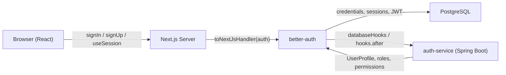
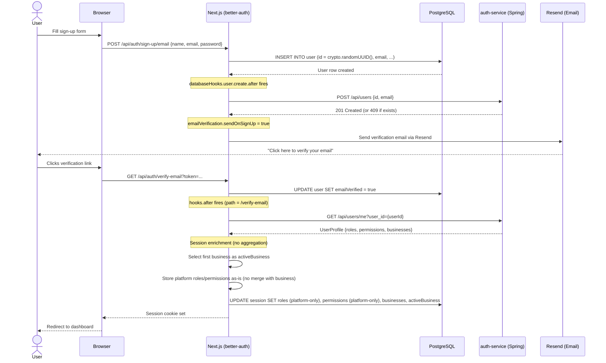
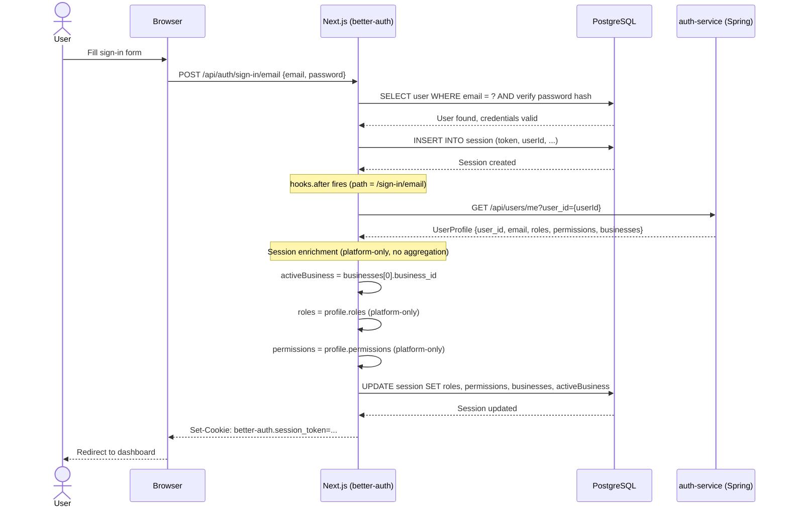
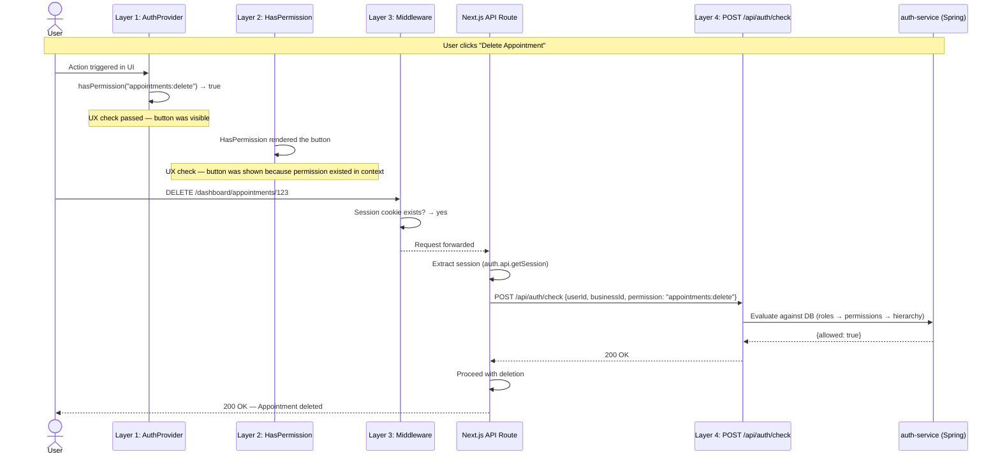

# ClinicHub Frontend Authorization Architecture — better-auth

> Prescriptive design document for implementing authentication and authorization in a ClinicHub Next.js frontend using better-auth. Covers the better-auth implementation, a four-layer frontend authorization model, session enrichment, and JWT claim structure.

---

## Table of Contents

1. [better-auth Architecture & Flow](#1-better-auth-architecture--flow)
   - [1.1 High-Level Architecture](#11-high-level-architecture)
   - [1.2 Sign-Up Flow](#12-sign-up-flow)
   - [1.3 Sign-In Flow](#13-sign-in-flow)
   - [1.4 Session Enrichment](#14-session-enrichment)
   - [1.5 JWT Claim Structure](#15-jwt-claim-structure)
   - [1.6 Data Model — Session Table](#16-data-model--session-table)
2. [Four-Layer Frontend Authorization Enforcement](#2-four-layer-frontend-authorization-enforcement)
   - [2.1 Layer Overview](#21-layer-overview)
   - [2.2 Layer 1 — AuthProvider (React Context)](#22-layer-1--authprovider-react-context)
   - [2.3 Layer 2 — Declarative Components](#23-layer-2--declarative-components)
   - [2.4 Layer 3 — Next.js Middleware](#24-layer-3--nextjs-middleware)
   - [2.5 Layer 4 — API-Level Enforcement](#25-layer-4--api-level-enforcement)
   - [2.6 Why Layers 1–3 Are UX-Only](#26-why-layers-13-are-ux-only)
   - [2.7 End-to-End Enforcement Flow](#27-end-to-end-enforcement-flow)
3. [Key Design Decisions](#3-key-design-decisions)
4. [Glossary](#4-glossary)

---

## 1. better-auth Architecture & Flow

### 1.1 High-Level Architecture

The system is composed of three runtime boundaries: the browser (React SPA), the Next.js server (which hosts better-auth), and the Spring Boot auth-service. better-auth owns credential storage and session management in PostgreSQL, while the auth-service owns the authorization domain model (users, roles, permissions, business memberships).



**Files to implement:**

| File | Responsibility |
|---|---|
| `lib/auth.ts` | better-auth server configuration — DB, hooks, session fields, JWT plugin |
| `lib/auth-client.ts` | React client — `signIn`, `signUp`, `signOut`, `useSession` |
| `services/auth-service.ts` | HTTP client for Spring auth-service (`createUser`, `me`, `checkPermission`) |
| `middleware.ts` | Next.js edge middleware — session cookie check |
| `app/api/auth/[...all]/route.ts` | Catch-all API route delegating to `toNextJsHandler(auth)` |
| `types/business.ts` | `BusinessContext`, `UserProfile` interfaces |
| `types/auth.ts` | `EnrichedSession`, `ParsedSessionFields` interfaces |
| `lib/auth-provider.tsx` | Layer 1 — React context providing parsed auth state and runtime aggregation |
| `components/auth/HasPermission.tsx` | Layer 2 — Declarative permission guard component |
| `components/auth/HasRole.tsx` | Layer 2 — Declarative role guard component |


### 1.2 Sign-Up Flow



**Key points:**
- User provisioning on the auth-service must happen synchronously inside `databaseHooks.user.create.after`, before the sign-up response is returned.
- The `createUser` call must be idempotent — a `409 Conflict` should be silently ignored.
- Session enrichment should only happen after email verification (the `hooks.after` middleware checks for `/verify-email` path).

### 1.3 Sign-In Flow



**Key points:**
- Every sign-in must trigger a fresh `me()` call to the auth-service, ensuring roles and permissions are always current.
- The session token should be extracted from `ctx.context.returned.token` (for sign-in) or `ctx.context.session.session.token` (for verify-email).
- If the auth-service is unreachable, the session should be created with default empty arrays — the user is authenticated but has no permissions.


### 1.4 Session Enrichment

Session enrichment is the process of decorating the better-auth session with authorization data from the auth-service. It must run inside the `hooks.after` middleware (`createAuthMiddleware`) and should be triggered only on these paths:

- `/sign-in/email`
- `/sign-up/email`
- `/verify-email`

**Enrichment algorithm:**

```typescript
// 1. Fetch the full user profile from auth-service
const profile: UserProfile = await me(userId);

// 2. Extract all business memberships
const businesses: BusinessContext[] = profile.businesses ?? [];

// 3. Select the first business as the active business
const activeBusinessId = businesses.length > 0
  ? businesses[0].business_id
  : "";

// 4. Store platform-only roles/permissions — no aggregation with business claims.
//    Aggregation is done downstream by the AuthProvider (for UI) or
//    the auth-service POST /api/auth/check (for real enforcement).
const roles: string[] = profile.roles ?? [];       // e.g. ["PLATFORM_ADMIN"]
const permissions: string[] = profile.permissions ?? []; // e.g. ["user:read", "user:write"]

// 5. Persist to session table
await ctx.context.internalAdapter.updateSession(token, {
  roles: JSON.stringify(roles),
  permissions: JSON.stringify(permissions),
  businesses: JSON.stringify(businesses),
  activeBusiness: activeBusinessId,
});
```

**Why the session stores platform-only claims:**
The session (and JWT) carries platform roles/permissions as top-level claims and each business's roles/permissions nested inside `custom:businesses`. Aggregation — merging platform + active business into a single effective set — is a runtime concern that depends on which business the user has selected. This is handled by:
- The **AuthProvider** (Layer 1) on the frontend, which re-aggregates whenever `activeBusiness` changes.
- The **auth-service** (`POST /api/auth/check`, Layer 4) on the backend, which evaluates against the database.

This design means switching businesses doesn't require a new token or session update — the frontend simply re-computes the effective set from data already in the token.

### 1.5 JWT Claim Structure

The JWT plugin (`better-auth/plugins/jwt`) must produce tokens with a 1-hour expiration. The `definePayload` callback should map session fields into custom claims:

```json
{
  "sub": "550e8400-e29b-41d4-a716-446655440000",
  "custom:roles": ["PLATFORM_ADMIN"],
  "custom:permissions": ["user:read", "user:write"],
  "custom:businesses": [
    {
      "business_id": "b1a2c3d4-...",
      "member_id": "m5e6f7a8-...",
      "roles": ["OWNER"],
      "permissions": ["appointments:read", "appointments:write", "billing:read", "billing:write"]
    }
  ],
  "iat": 1713700000,
  "exp": 1713703600
}
```

| Claim | Type | Source |
|---|---|---|
| `sub` | `string (UUID)` | `session.user.id` |
| `custom:roles` | `string[]` | Platform-only roles from `session.roles` JSON string |
| `custom:permissions` | `string[]` | Platform-only permissions from `session.permissions` JSON string |
| `custom:businesses` | `BusinessContext[]` | All business memberships with per-business roles/permissions from `session.businesses` JSON string |
| `iat` | `number` | Issued-at timestamp (auto) |
| `exp` | `number` | Expiration = `iat + 3600` (1 hour) |

The `custom:` prefix is intentional — it mirrors the Cognito custom attribute naming convention, making a future migration path smoother.

Note that `custom:roles` and `custom:permissions` contain **platform-scoped** values only. Business-scoped roles and permissions live inside each entry of `custom:businesses`. The consumer (AuthProvider or downstream service) is responsible for aggregating platform + active business claims at runtime.

### 1.6 Data Model — Session Table

better-auth manages the `session` table in PostgreSQL. The `session.additionalFields` configuration must add four columns:

| Column | SQL Type | Default | Description |
|---|---|---|---|
| `roles` | `text` | `"[]"` | JSON-encoded array of platform-only role names |
| `permissions` | `text` | `"[]"` | JSON-encoded array of platform-only permission strings |
| `businesses` | `text` | `"[]"` | JSON-encoded array of `BusinessContext` objects (all memberships) |
| `activeBusiness` | `text` | `""` | UUID string of the currently selected business (empty if none) |

These columns must be stored as JSON strings (not `jsonb`) because better-auth's `additionalFields` only supports `type: "string"`. The frontend and JWT plugin parse them at read time.

**TypeScript representation:**

```typescript
// types/auth.ts — raw session shape from useSession()
interface EnrichedSession {
  user: { id: string; email: string; name: string; /* ... */ };
  session: {
    id: string; userId: string; token: string; expiresAt: Date;
    // Custom fields — JSON strings
    roles: string;        // '["PLATFORM_ADMIN"]'
    permissions: string;  // '["user:read","user:write"]'
    businesses: string;   // '[{"business_id":"...","member_id":"...","roles":[...],"permissions":[...]}]'
    activeBusiness: string; // "b1a2c3d4-..."
  };
}

// types/auth.ts — parsed form for application use
interface ParsedSessionFields {
  roles: string[];
  permissions: string[];
  businesses: BusinessContext[];
  activeBusiness: string;
}
```

---


## 2. Four-Layer Frontend Authorization Enforcement

### 2.1 Layer Overview

| # | Layer | Where it runs | What it checks | Trust level | Purpose |
|---|---|---|---|---|---|
| 1 | **AuthProvider** (React Context) | Browser | Parsed session fields (roles, permissions, businesses) | None — client-side state | Provide auth context to React tree; enable conditional rendering |
| 2 | **Declarative Components** (`<HasPermission>`, `<HasRole>`) | Browser | AuthProvider context values | None — pure UI convenience | Hide/show UI elements based on permissions; reduce boilerplate |
| 3 | **Next.js Middleware** (`middleware.ts`) | Edge (server) | Session cookie existence; optionally role claims | Low — cookies can be forged | Redirect unauthenticated users; coarse route protection |
| 4 | **API-Level Enforcement** (`POST /api/auth/check`) | auth-service (Spring Boot) | Database-backed role/permission evaluation | **High — single source of truth** | **Real security boundary**; gate sensitive operations server-side |

### 2.2 Layer 1 — AuthProvider (React Context)

The `AuthProvider` must wrap the application and expose parsed authorization data to all child components.

```typescript
// lib/auth-provider.tsx
"use client";

import {
  createContext,
  useContext,
  useMemo,
  useState,
  useCallback,
  type ReactNode,
} from "react";
import { useSession } from "@/lib/auth-client";
import type { BusinessContext } from "@/types/business";

export interface AuthContextValue {
  user: { id: string; email: string; name: string } | null;
  roles: string[];
  permissions: string[];
  businesses: BusinessContext[];
  activeBusiness: string;
  isAuthenticated: boolean;
  setActiveBusiness: (businessId: string) => void;
  hasPermission: (permission: string) => boolean;
  hasRole: (role: string) => boolean;
}

const AuthContext = createContext<AuthContextValue | null>(null);

export function AuthProvider({ children }: Readonly<{ children: ReactNode }>) {
  const { data: session, isPending } = useSession();

  const parsed = useMemo(() => {
    if (!session?.session) {
      return { roles: [], permissions: [], businesses: [], activeBusiness: "" };
    }
    const s = session.session as unknown as Record<string, string>;
    return {
      roles: JSON.parse(s.roles ?? "[]") as string[],
      permissions: JSON.parse(s.permissions ?? "[]") as string[],
      businesses: JSON.parse(s.businesses ?? "[]") as BusinessContext[],
      activeBusiness: (s.activeBusiness ?? "") as string,
    };
  }, [session]);

  const [overrideBusinessId, setOverrideBusinessId] = useState<string | null>(null);
  const activeBusinessId = overrideBusinessId ?? parsed.activeBusiness;

  // Aggregate platform + active business roles/permissions at runtime.
  // The session stores platform-only claims; business claims live in parsed.businesses.
  const aggregated = useMemo(() => {
    const activeBiz = parsed.businesses.find(
      (b) => b.business_id === activeBusinessId
    );
    const roles = [...parsed.roles, ...(activeBiz?.roles ?? [])];
    const permissions = [...parsed.permissions, ...(activeBiz?.permissions ?? [])];
    return { roles, permissions };
  }, [parsed, activeBusinessId]);

  const hasPermission = useCallback(
    (permission: string) => aggregated.permissions.includes(permission),
    [aggregated.permissions]
  );

  const hasRole = useCallback(
    (role: string) => aggregated.roles.includes(role),
    [aggregated.roles]
  );

  const setActiveBusiness = useCallback((businessId: string) => {
    setOverrideBusinessId(businessId);
  }, []);

  const value: AuthContextValue = useMemo(
    () => ({
      user: session?.user
        ? {
            id: session.user.id,
            email: session.user.email,
            name: session.user.name,
          }
        : null,
      roles: aggregated.roles,
      permissions: aggregated.permissions,
      businesses: parsed.businesses,
      activeBusiness: activeBusinessId,
      isAuthenticated: !!session?.user,
      setActiveBusiness,
      hasPermission,
      hasRole,
    }),
    [session, aggregated, parsed.businesses, activeBusinessId, setActiveBusiness, hasPermission, hasRole]
  );

  if (isPending) return null;

  return <AuthContext.Provider value={value}>{children}</AuthContext.Provider>;
}

export function useAuth(): AuthContextValue {
  const ctx = useContext(AuthContext);
  if (!ctx) throw new Error("useAuth must be used within <AuthProvider>");
  return ctx;
}
```


### 2.3 Layer 2 — Declarative Components

These components consume the `AuthProvider` context and conditionally render children. They are pure UI convenience — they must never enforce security.

```typescript
// components/auth/HasPermission.tsx
"use client";

import { useAuth } from "@/lib/auth-provider";
import type { ReactNode } from "react";

interface RequirePermissionProps {
  permission: string | string[];
  operator?: "every" | "some";
  fallback?: ReactNode;
  children: ReactNode;
}

export function HasPermission({
  permission,
  operator = "every",
  fallback = null,
  children,
}: RequirePermissionProps) {
  const { hasPermission } = useAuth();
  const perms = Array.isArray(permission) ? permission : [permission];
  const granted = operator === "every"
    ? perms.every(hasPermission)
    : perms.some(hasPermission);
  return granted ? <>{children}</> : <>{fallback}</>;
}
```

```typescript
// components/auth/HasRole.tsx
"use client";

import { useAuth } from "@/lib/auth-provider";
import type { ReactNode } from "react";

interface RequireRoleProps {
  role: string | string[];
  operator?: "every" | "some";
  fallback?: ReactNode;
  children: ReactNode;
}

export function HasRole({
  role,
  operator = "every",
  fallback = null,
  children,
}: RequireRoleProps) {
  const { hasRole } = useAuth();
  const roles = Array.isArray(role) ? role : [role];
  const granted = operator === "every"
    ? roles.every(hasRole)
    : roles.some(hasRole);
  return granted ? <>{children}</> : <>{fallback}</>;
}
```

**Usage examples:**

```tsx
{/* Single permission */}
<HasPermission permission="appointments:write">
  <button onClick={handleDeleteAppointment}>Delete Appointment</button>
</HasPermission>

{/* All required (default operator="every") */}
<HasPermission permission={["appointments:read", "appointments:write"]}>
  <AppointmentEditor />
</HasPermission>

{/* Any one suffices */}
<HasPermission permission={["billing:read", "billing:manage"]} operator="some">
  <BillingDashboard />
</HasPermission>

{/* Single role */}
<HasRole role="OWNER" fallback={<p>Owner access required.</p>}>
  <ClinicSettingsPanel />
</HasRole>

{/* Any of these roles */}
<HasRole role={["OWNER", "PLATFORM_ADMIN"]} operator="some">
  <AdminPanel />
</HasRole>
```

### 2.4 Layer 3 — Next.js Middleware

The middleware (`middleware.ts`) must perform a session cookie existence check:

```typescript
// middleware.ts
import { NextRequest, NextResponse } from "next/server";
import { getSessionCookie } from "better-auth/cookies";

export function middleware(req: NextRequest) {
  const session = getSessionCookie(req);
  if (!session) {
    return NextResponse.redirect(new URL("/signin", req.url));
  }
  return NextResponse.next();
}

export const config = {
  matcher: ["/dashboard/:path*"],
};
```

**Potential extension** — role-based route protection (optional):

```typescript
// middleware.ts (extended — illustrative)
import { NextRequest, NextResponse } from "next/server";
import { getSessionCookie } from "better-auth/cookies";

const ROLE_ROUTES: Record<string, string[]> = {
  "/dashboard/admin": ["PLATFORM_ADMIN"],
  "/dashboard/billing": ["OWNER", "BILLING_MANAGER"],
};

export function middleware(req: NextRequest) {
  const session = getSessionCookie(req);
  if (!session) {
    return NextResponse.redirect(new URL("/signin", req.url));
  }

  // NOTE: Cookie-based role checks are UX-only — not a security boundary.
  // Roles in the cookie could be stale or tampered with.
  // Real enforcement happens at Layer 4 (auth-service).

  return NextResponse.next();
}

export const config = {
  matcher: ["/dashboard/:path*"],
};
```

### 2.5 Layer 4 — API-Level Enforcement (The Real Guard)

This is the only layer that provides actual security. The Spring auth-service exposes `POST /api/auth/check` which evaluates permissions against the database. The Next.js frontend must call this endpoint server-side before performing any sensitive operation.

**API contract** (from `openapi.yaml`):

```typescript
// Request
interface AuthCheckRequest {
  userId: string;      // UUID — required
  businessId?: string; // UUID — optional, for business-scoped checks
  permission: string;  // resource:action format, e.g. "appointments:delete"
}

// Response
interface AuthCheckResponse {
  allowed: boolean;
}
```

**Server-side usage** (Next.js API route or Server Component):

```typescript
// services/auth-service.ts
export async function checkPermission(
  userId: string,
  permission: string,
  businessId?: string
): Promise<boolean> {
  const response = await fetch(`${AUTH_SERVICE_URL}/api/auth/check`, {
    method: "POST",
    headers,
    body: JSON.stringify({
      userId,
      permission,
      ...(businessId ? { businessId } : {}),
    }),
  });
  if (!response.ok) return false;
  const data: { allowed: boolean } = await response.json();
  return data.allowed;
}
```

```typescript
// app/api/appointments/[id]/route.ts (example usage)
import { auth } from "@/lib/auth";
import { checkPermission } from "@/services/auth-service";
import { NextRequest, NextResponse } from "next/server";

export async function DELETE(req: NextRequest, { params }: { params: { id: string } }) {
  const session = await auth.api.getSession({ headers: req.headers });
  if (!session) {
    return NextResponse.json({ error: "Unauthorized" }, { status: 401 });
  }

  const activeBusiness = session.session.activeBusiness;
  const allowed = await checkPermission(
    session.user.id,
    "appointments:delete",
    activeBusiness || undefined
  );

  if (!allowed) {
    return NextResponse.json({ error: "Forbidden" }, { status: 403 });
  }

  // ... proceed with deletion
}
```


### 2.6 Why Layers 1–3 Are UX-Only

| Concern | Layers 1–3 | Layer 4 |
|---|---|---|
| **Data source** | Session cookie / client-side state | auth-service database (PostgreSQL) |
| **Can be tampered with?** | Yes — cookies can be modified, JS state can be manipulated via devtools | No — server-side evaluation against the DB |
| **Can be stale?** | Yes — session enrichment only runs on sign-in/sign-up/verify-email | No — evaluates current DB state on every call |
| **Runs where?** | Browser (L1, L2) or Edge (L3) | Spring Boot server |
| **Purpose** | Fast UX decisions: hide buttons, redirect early, show/hide sections | Enforce authorization before mutating data |

**The rule is simple:** Layers 1–3 prevent users from seeing things they shouldn't. Layer 4 prevents users from doing things they shouldn't. Never trust the frontend for security.

### 2.7 End-to-End Enforcement Flow

This diagram shows how a sensitive action ("delete appointment") passes through all four layers:



If the user had tampered with their session cookie to include `appointments:delete` but didn't actually have that permission in the database, Layers 1–3 would pass but Layer 4 would return `{allowed: false}` and the API route would respond with `403 Forbidden`.

---

## 3. Key Design Decisions

| Decision | Rationale |
|---|---|
| **Session enrichment on sign-in, not on every request** | Calling `GET /api/users/me` on every request would add ~50-100ms latency. Enriching at sign-in and storing in the session is a pragmatic trade-off. Permissions are "eventually consistent" — a revoked permission takes effect on next sign-in. |
| **JSON strings in session columns, not `jsonb`** | better-auth's `additionalFields` only supports `type: "string"`. This is a framework constraint, not a design choice. Parsing happens at read time in the AuthProvider and JWT plugin. |
| **`custom:` prefix on JWT claims** | Mirrors the Cognito custom attribute naming convention. This was a deliberate forward-looking decision to minimize claim mapping work during a future migration. |
| **Four-layer authorization model** | Defense in depth. Layers 1–3 provide fast UX feedback. Layer 4 provides real security. This separation means frontend developers can build responsive UIs without worrying about security, while backend enforcement is never bypassed. |
| **auth-service as the single source of truth** | All authorization decisions ultimately resolve to the auth-service database. better-auth is an identity provider only — it does not own the authorization model. This makes the identity provider swappable. |
| **First business as default activeBusiness** | Simple heuristic for MVP. Future enhancement: persist the user's last-selected business and restore it on sign-in. |
| **No aggregation at token/session time** | The session and JWT store platform-only roles/permissions in top-level claims, with business-scoped claims nested inside `custom:businesses`. Aggregation (platform + active business) is a runtime concern handled by the AuthProvider (frontend) or `POST /api/auth/check` (backend). This means switching businesses doesn't require a new token — the frontend re-computes the effective set from data already present. |

---

## 4. Glossary

| Term | Definition |
|---|---|
| **Platform roles** | Roles scoped to the entire ClinicHub platform (e.g., `PLATFORM_ADMIN`, `SUPPORT_AGENT`). Assigned directly to a user via `POST /api/users/{userId}/roles`. Apply regardless of which business is active. |
| **Business roles** | Roles scoped to a specific business/clinic (e.g., `OWNER`, `PRACTITIONER`, `RECEPTIONIST`). Assigned to a business membership via `POST /api/business-members/{id}/roles`. Only active when the corresponding business is selected. |
| **Business context** | The combination of `business_id`, `member_id`, `roles[]`, and `permissions[]` that describes a user's membership in a specific business. A user can have multiple business contexts. Represented by the `BusinessContext` type in `types/business.ts`. |
| **Session enrichment** | The process of decorating a better-auth session with authorization data (roles, permissions, businesses) fetched from the auth-service. Runs inside `hooks.after` on sign-in, sign-up, and email verification. Stores platform-only roles/permissions as top-level fields and all business memberships in the `businesses` field. Does **not** aggregate platform + business claims — that is a downstream concern. |
| **Claim aggregation** | The runtime merging of platform-level roles/permissions with the active business's roles/permissions into a single effective set. Formula: `effective = [...platformRoles, ...activeBusinessRoles]`. Performed by the AuthProvider (for UI decisions) or the auth-service (for real enforcement). Never done at token issuance time — the token carries the raw, un-aggregated data. |
| **Active business** | The currently selected business context for a user. Determines which business roles and permissions are included in the aggregated session. Defaults to the first business in the user's membership list. |
| **Layer 4 check** | A server-side call to `POST /api/auth/check` on the auth-service that evaluates a permission against the actual database. The only authorization check that should be trusted for security-sensitive operations. |
| **Identity provider (IdP)** | The system responsible for authenticating users and issuing tokens. In this architecture, better-auth. The IdP does not own the authorization model — it delegates to the auth-service. |
