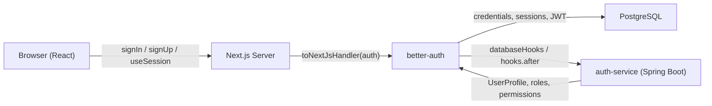
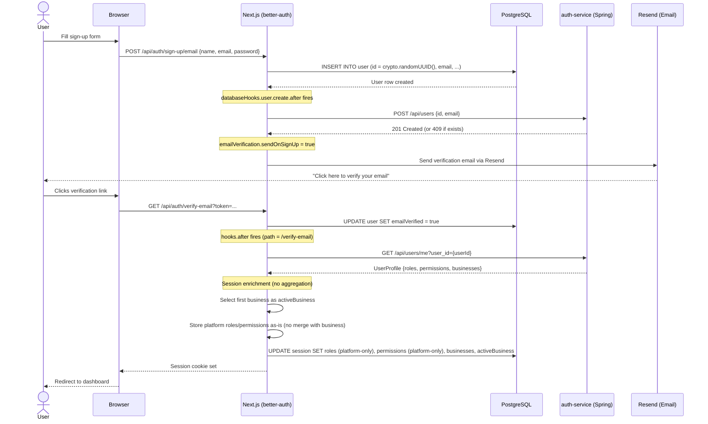
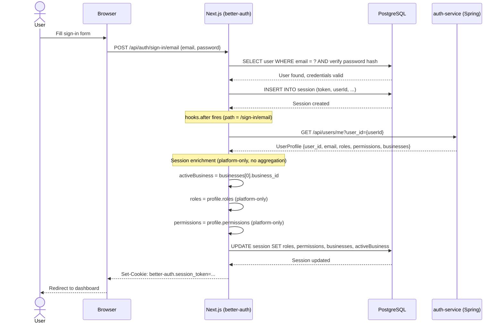
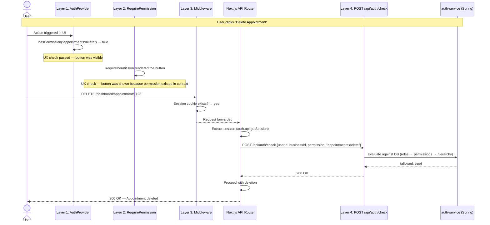

# ClinicHub Frontend Authorization Architecture

> Prescriptive design document for implementing authentication and authorization in a ClinicHub Next.js frontend. Covers the better-auth implementation, a four-layer frontend authorization model, and the future migration path to AWS Cognito.

---

## Table of Contents

1. [better-auth Architecture & Flow](#1-better-auth-architecture--flow)
   - [1.1 High-Level Architecture](#11-high-level-architecture)
   - [1.2 Sign-Up Flow](#12-sign-up-flow)
   - [1.3 Sign-In Flow](#13-sign-in-flow)
   - [1.4 Session Enrichment](#14-session-enrichment)
   - [1.5 JWT Claim Structure](#15-jwt-claim-structure)
   - [1.6 Data Model — Session Table](#16-data-model--session-table)
2. [Four-Layer Frontend Authorization Enforcement](#2-four-layer-frontend-authorization-enforcement)
   - [2.1 Layer Overview](#21-layer-overview)
   - [2.2 Layer 1 — AuthProvider (React Context)](#22-layer-1--authprovider-react-context)
   - [2.3 Layer 2 — Declarative Components](#23-layer-2--declarative-components)
   - [2.4 Layer 3 — Next.js Middleware](#24-layer-3--nextjs-middleware)
   - [2.5 Layer 4 — API-Level Enforcement](#25-layer-4--api-level-enforcement)
   - [2.6 Why Layers 1–3 Are UX-Only](#26-why-layers-13-are-ux-only)
   - [2.7 End-to-End Enforcement Flow](#27-end-to-end-enforcement-flow)
3. [Cognito Migration Path](#3-cognito-migration-path)
   - [3.1 Hook Equivalence Table](#31-hook-equivalence-table)
   - [3.2 Frontend File Changes](#32-frontend-file-changes)
   - [3.3 What Stays the Same](#33-what-stays-the-same)
   - [3.4 Side-by-Side Comparison](#34-side-by-side-comparison)
   - [3.5 Migration Checklist](#35-migration-checklist)
   - [3.6 Adapter Pattern Proposal](#36-adapter-pattern-proposal)
   - [3.7 Spring Security Dual-Profile Support](#37-spring-security-dual-profile-support)
   - [3.8 Risk Assessment & Rollback Strategy](#38-risk-assessment--rollback-strategy)
4. [Key Design Decisions](#4-key-design-decisions)
5. [Glossary](#5-glossary)

---

## 1. better-auth Architecture & Flow

### 1.1 High-Level Architecture

The system is composed of three runtime boundaries: the browser (React SPA), the Next.js server (which hosts better-auth), and the Spring Boot auth-service. better-auth owns credential storage and session management in PostgreSQL, while the auth-service owns the authorization domain model (users, roles, permissions, business memberships).



**Files to implement:**

| File | Responsibility |
|---|---|
| `lib/auth.ts` | better-auth server configuration — DB, hooks, session fields, JWT plugin |
| `lib/auth-client.ts` | React client — `signIn`, `signUp`, `signOut`, `useSession` |
| `services/auth-service.ts` | HTTP client for Spring auth-service (`createUser`, `me`, `checkPermission`) |
| `middleware.ts` | Next.js edge middleware — session cookie check |
| `app/api/auth/[...all]/route.ts` | Catch-all API route delegating to `toNextJsHandler(auth)` |
| `types/business.ts` | `BusinessContext`, `UserProfile` interfaces |
| `types/auth.ts` | `EnrichedSession`, `ParsedSessionFields` interfaces |
| `lib/auth-provider.tsx` | Layer 1 — React context providing parsed auth state and runtime aggregation |
| `components/shared/RequirePermission.tsx` | Layer 2 — Declarative permission guard component |
| `components/shared/RequireRole.tsx` | Layer 2 — Declarative role guard component |


### 1.2 Sign-Up Flow



**Key points:**
- User provisioning on the auth-service must happen synchronously inside `databaseHooks.user.create.after`, before the sign-up response is returned.
- The `createUser` call must be idempotent — a `409 Conflict` should be silently ignored.
- Session enrichment should only happen after email verification (the `hooks.after` middleware checks for `/verify-email` path).

### 1.3 Sign-In Flow



**Key points:**
- Every sign-in must trigger a fresh `me()` call to the auth-service, ensuring roles and permissions are always current.
- The session token should be extracted from `ctx.context.returned.token` (for sign-in) or `ctx.context.session.session.token` (for verify-email).
- If the auth-service is unreachable, the session should be created with default empty arrays — the user is authenticated but has no permissions.


### 1.4 Session Enrichment

Session enrichment is the process of decorating the better-auth session with authorization data from the auth-service. It must run inside the `hooks.after` middleware (`createAuthMiddleware`) and should be triggered only on these paths:

- `/sign-in/email`
- `/sign-up/email`
- `/verify-email`

**Enrichment algorithm:**

```typescript
// 1. Fetch the full user profile from auth-service
const profile: UserProfile = await me(userId);

// 2. Extract all business memberships
const businesses: BusinessContext[] = profile.businesses ?? [];

// 3. Select the first business as the active business
const activeBusinessId = businesses.length > 0
  ? businesses[0].business_id
  : "";

// 4. Store platform-only roles/permissions — no aggregation with business claims.
//    Aggregation is done downstream by the AuthProvider (for UI) or
//    the auth-service POST /api/auth/check (for real enforcement).
const roles: string[] = profile.roles ?? [];       // e.g. ["PLATFORM_ADMIN"]
const permissions: string[] = profile.permissions ?? []; // e.g. ["user:read", "user:write"]

// 5. Persist to session table
await ctx.context.internalAdapter.updateSession(token, {
  roles: JSON.stringify(roles),
  permissions: JSON.stringify(permissions),
  businesses: JSON.stringify(businesses),
  activeBusiness: activeBusinessId,
});
```

**Why the session stores platform-only claims:**
The session (and JWT) carries platform roles/permissions as top-level claims and each business's roles/permissions nested inside `custom:businesses`. Aggregation — merging platform + active business into a single effective set — is a runtime concern that depends on which business the user has selected. This is handled by:
- The **AuthProvider** (Layer 1) on the frontend, which re-aggregates whenever `activeBusiness` changes.
- The **auth-service** (`POST /api/auth/check`, Layer 4) on the backend, which evaluates against the database.

This design means switching businesses doesn't require a new token or session update — the frontend simply re-computes the effective set from data already in the token.

### 1.5 JWT Claim Structure

The JWT plugin (`better-auth/plugins/jwt`) must produce tokens with a 1-hour expiration. The `definePayload` callback should map session fields into custom claims:

```json
{
  "sub": "550e8400-e29b-41d4-a716-446655440000",
  "custom:roles": ["PLATFORM_ADMIN"],
  "custom:permissions": ["user:read", "user:write"],
  "custom:businesses": [
    {
      "business_id": "b1a2c3d4-...",
      "member_id": "m5e6f7a8-...",
      "roles": ["CLINIC_OWNER"],
      "permissions": ["appointments:read", "appointments:write", "billing:read", "billing:write"]
    }
  ],
  "iat": 1713700000,
  "exp": 1713703600
}
```

| Claim | Type | Source |
|---|---|---|
| `sub` | `string (UUID)` | `session.user.id` |
| `custom:roles` | `string[]` | Platform-only roles from `session.roles` JSON string |
| `custom:permissions` | `string[]` | Platform-only permissions from `session.permissions` JSON string |
| `custom:businesses` | `BusinessContext[]` | All business memberships with per-business roles/permissions from `session.businesses` JSON string |
| `iat` | `number` | Issued-at timestamp (auto) |
| `exp` | `number` | Expiration = `iat + 3600` (1 hour) |

The `custom:` prefix is intentional — it mirrors the Cognito custom attribute naming convention, making the migration path smoother.

Note that `custom:roles` and `custom:permissions` contain **platform-scoped** values only. Business-scoped roles and permissions live inside each entry of `custom:businesses`. The consumer (AuthProvider or downstream service) is responsible for aggregating platform + active business claims at runtime.

### 1.6 Data Model — Session Table

better-auth manages the `session` table in PostgreSQL. The `session.additionalFields` configuration must add four columns:

| Column | SQL Type | Default | Description |
|---|---|---|---|
| `roles` | `text` | `"[]"` | JSON-encoded array of platform-only role names |
| `permissions` | `text` | `"[]"` | JSON-encoded array of platform-only permission strings |
| `businesses` | `text` | `"[]"` | JSON-encoded array of `BusinessContext` objects (all memberships) |
| `activeBusiness` | `text` | `""` | UUID string of the currently selected business (empty if none) |

These columns must be stored as JSON strings (not `jsonb`) because better-auth's `additionalFields` only supports `type: "string"`. The frontend and JWT plugin parse them at read time.

**TypeScript representation:**

```typescript
// types/auth.ts — raw session shape from useSession()
interface EnrichedSession {
  user: { id: string; email: string; name: string; /* ... */ };
  session: {
    id: string; userId: string; token: string; expiresAt: Date;
    // Custom fields — JSON strings
    roles: string;        // '["PLATFORM_ADMIN"]'
    permissions: string;  // '["user:read","user:write"]'
    businesses: string;   // '[{"business_id":"...","member_id":"...","roles":[...],"permissions":[...]}]'
    activeBusiness: string; // "b1a2c3d4-..."
  };
}

// types/auth.ts — parsed form for application use
interface ParsedSessionFields {
  roles: string[];
  permissions: string[];
  businesses: BusinessContext[];
  activeBusiness: string;
}
```

---


## 2. Four-Layer Frontend Authorization Enforcement

### 2.1 Layer Overview

| # | Layer | Where it runs | What it checks | Trust level | Purpose |
|---|---|---|---|---|---|
| 1 | **AuthProvider** (React Context) | Browser | Parsed session fields (roles, permissions, businesses) | None — client-side state | Provide auth context to React tree; enable conditional rendering |
| 2 | **Declarative Components** (`<RequirePermission>`, `<RequireRole>`) | Browser | AuthProvider context values | None — pure UI convenience | Hide/show UI elements based on permissions; reduce boilerplate |
| 3 | **Next.js Middleware** (`middleware.ts`) | Edge (server) | Session cookie existence; optionally role claims | Low — cookies can be forged | Redirect unauthenticated users; coarse route protection |
| 4 | **API-Level Enforcement** (`POST /api/auth/check`) | auth-service (Spring Boot) | Database-backed role/permission evaluation | **High — single source of truth** | **Real security boundary**; gate sensitive operations server-side |

### 2.2 Layer 1 — AuthProvider (React Context)

The `AuthProvider` must wrap the application and expose parsed authorization data to all child components.

```typescript
// lib/auth-provider.tsx
"use client";

import {
  createContext,
  useContext,
  useEffect,
  useMemo,
  useState,
  useCallback,
  type ReactNode,
} from "react";
import { useSession } from "@/lib/auth-client";
import type { BusinessContext } from "@/types/business";

export interface AuthContextValue {
  user: { id: string; email: string; name: string } | null;
  roles: string[];
  permissions: string[];
  businesses: BusinessContext[];
  activeBusiness: string;
  isAuthenticated: boolean;
  setActiveBusiness: (businessId: string) => void;
  hasPermission: (permission: string) => boolean;
  hasRole: (role: string) => boolean;
}

const AuthContext = createContext<AuthContextValue | null>(null);

export function AuthProvider({ children }: { children: ReactNode }) {
  const { data: session, isPending } = useSession();

  const parsed = useMemo(() => {
    if (!session?.session) {
      return { roles: [], permissions: [], businesses: [], activeBusiness: "" };
    }
    const s = session.session as unknown as Record<string, string>;
    return {
      roles: JSON.parse(s.roles ?? "[]") as string[],
      permissions: JSON.parse(s.permissions ?? "[]") as string[],
      businesses: JSON.parse(s.businesses ?? "[]") as BusinessContext[],
      activeBusiness: (s.activeBusiness ?? "") as string,
    };
  }, [session]);

  const [activeBusinessId, setActiveBusinessId] = useState(parsed.activeBusiness);

  // Sync state when session loads or changes (useState only captures the initial value)
  useEffect(() => {
    setActiveBusinessId(parsed.activeBusiness);
  }, [parsed.activeBusiness]);

  // Aggregate platform + active business roles/permissions at runtime.
  // The session stores platform-only claims; business claims live in parsed.businesses.
  const aggregated = useMemo(() => {
    const activeBiz = parsed.businesses.find(
      (b) => b.business_id === activeBusinessId
    );
    const roles = [...parsed.roles, ...(activeBiz?.roles ?? [])];
    const permissions = [...parsed.permissions, ...(activeBiz?.permissions ?? [])];
    return { roles, permissions };
  }, [parsed, activeBusinessId]);

  const hasPermission = useCallback(
    (permission: string) => aggregated.permissions.includes(permission),
    [aggregated.permissions]
  );

  const hasRole = useCallback(
    (role: string) => aggregated.roles.includes(role),
    [aggregated.roles]
  );

  const setActiveBusiness = useCallback((businessId: string) => {
    setActiveBusinessId(businessId);
  }, []);

  const value: AuthContextValue = useMemo(
    () => ({
      user: session?.user
        ? {
            id: session.user.id,
            email: session.user.email,
            name: session.user.name,
          }
        : null,
      roles: aggregated.roles,
      permissions: aggregated.permissions,
      businesses: parsed.businesses,
      activeBusiness: activeBusinessId,
      isAuthenticated: !!session?.user,
      setActiveBusiness,
      hasPermission,
      hasRole,
    }),
    [session, aggregated, parsed.businesses, activeBusinessId, setActiveBusiness, hasPermission, hasRole]
  );

  if (isPending) return null;

  return <AuthContext.Provider value={value}>{children}</AuthContext.Provider>;
}

export function useAuth(): AuthContextValue {
  const ctx = useContext(AuthContext);
  if (!ctx) throw new Error("useAuth must be used within <AuthProvider>");
  return ctx;
}
```


### 2.3 Layer 2 — Declarative Components

These components consume the `AuthProvider` context and conditionally render children. They are pure UI convenience — they must never enforce security.

```typescript
// components/shared/RequirePermission.tsx
"use client";

import { useAuth } from "@/lib/auth-provider";
import type { ReactNode } from "react";

interface RequirePermissionProps {
  permission: string;
  fallback?: ReactNode;
  children: ReactNode;
}

export function RequirePermission({
  permission,
  fallback = null,
  children,
}: RequirePermissionProps) {
  const { hasPermission } = useAuth();
  return hasPermission(permission) ? <>{children}</> : <>{fallback}</>;
}
```

```typescript
// components/shared/RequireRole.tsx
"use client";

import { useAuth } from "@/lib/auth-provider";
import type { ReactNode } from "react";

interface RequireRoleProps {
  role: string;
  fallback?: ReactNode;
  children: ReactNode;
}

export function RequireRole({
  role,
  fallback = null,
  children,
}: RequireRoleProps) {
  const { hasRole } = useAuth();
  return hasRole(role) ? <>{children}</> : <>{fallback}</>;
}
```

**Usage example:**

```tsx
<RequirePermission permission="appointments:write">
  <button onClick={handleDeleteAppointment}>Delete Appointment</button>
</RequirePermission>

<RequireRole role="CLINIC_OWNER" fallback={<p>Owner access required.</p>}>
  <ClinicSettingsPanel />
</RequireRole>
```

### 2.4 Layer 3 — Next.js Middleware

The middleware (`middleware.ts`) must perform a session cookie existence check:

```typescript
// middleware.ts
import { NextRequest, NextResponse } from "next/server";
import { getSessionCookie } from "better-auth/cookies";

export function middleware(req: NextRequest) {
  const session = getSessionCookie(req);
  if (!session) {
    return NextResponse.redirect(new URL("/signin", req.url));
  }
  return NextResponse.next();
}

export const config = {
  matcher: ["/dashboard/:path*"],
};
```

**Potential extension** — role-based route protection (optional):

```typescript
// middleware.ts (extended — illustrative)
import { NextRequest, NextResponse } from "next/server";
import { getSessionCookie } from "better-auth/cookies";

const ROLE_ROUTES: Record<string, string[]> = {
  "/dashboard/admin": ["PLATFORM_ADMIN"],
  "/dashboard/billing": ["CLINIC_OWNER", "BILLING_MANAGER"],
};

export function middleware(req: NextRequest) {
  const session = getSessionCookie(req);
  if (!session) {
    return NextResponse.redirect(new URL("/signin", req.url));
  }

  // NOTE: Cookie-based role checks are UX-only — not a security boundary.
  // Roles in the cookie could be stale or tampered with.
  // Real enforcement happens at Layer 4 (auth-service).

  return NextResponse.next();
}

export const config = {
  matcher: ["/dashboard/:path*"],
};
```

### 2.5 Layer 4 — API-Level Enforcement (The Real Guard)

This is the only layer that provides actual security. The Spring auth-service exposes `POST /api/auth/check` which evaluates permissions against the database. The Next.js frontend must call this endpoint server-side before performing any sensitive operation.

**API contract** (from `openapi.yaml`):

```typescript
// Request
interface AuthCheckRequest {
  userId: string;      // UUID — required
  businessId?: string; // UUID — optional, for business-scoped checks
  permission: string;  // resource:action format, e.g. "appointments:delete"
}

// Response
interface AuthCheckResponse {
  allowed: boolean;
}
```

**Server-side usage** (Next.js API route or Server Component):

```typescript
// services/auth-service.ts
export async function checkPermission(
  userId: string,
  permission: string,
  businessId?: string
): Promise<boolean> {
  const response = await fetch(`${AUTH_SERVICE_URL}/api/auth/check`, {
    method: "POST",
    headers,
    body: JSON.stringify({
      userId,
      permission,
      ...(businessId ? { businessId } : {}),
    }),
  });
  if (!response.ok) return false;
  const data: { allowed: boolean } = await response.json();
  return data.allowed;
}
```

```typescript
// app/api/appointments/[id]/route.ts (example usage)
import { auth } from "@/lib/auth";
import { checkPermission } from "@/services/auth-service";
import { NextRequest, NextResponse } from "next/server";

export async function DELETE(req: NextRequest, { params }: { params: { id: string } }) {
  const session = await auth.api.getSession({ headers: req.headers });
  if (!session) {
    return NextResponse.json({ error: "Unauthorized" }, { status: 401 });
  }

  const activeBusiness = session.session.activeBusiness;
  const allowed = await checkPermission(
    session.user.id,
    "appointments:delete",
    activeBusiness || undefined
  );

  if (!allowed) {
    return NextResponse.json({ error: "Forbidden" }, { status: 403 });
  }

  // ... proceed with deletion
}
```


### 2.6 Why Layers 1–3 Are UX-Only

| Concern | Layers 1–3 | Layer 4 |
|---|---|---|
| **Data source** | Session cookie / client-side state | auth-service database (PostgreSQL) |
| **Can be tampered with?** | Yes — cookies can be modified, JS state can be manipulated via devtools | No — server-side evaluation against the DB |
| **Can be stale?** | Yes — session enrichment only runs on sign-in/sign-up/verify-email | No — evaluates current DB state on every call |
| **Runs where?** | Browser (L1, L2) or Edge (L3) | Spring Boot server |
| **Purpose** | Fast UX decisions: hide buttons, redirect early, show/hide sections | Enforce authorization before mutating data |

**The rule is simple:** Layers 1–3 prevent users from seeing things they shouldn't. Layer 4 prevents users from doing things they shouldn't. Never trust the frontend for security.

### 2.7 End-to-End Enforcement Flow

This diagram shows how a sensitive action ("delete appointment") passes through all four layers:



If the user had tampered with their session cookie to include `appointments:delete` but didn't actually have that permission in the database, Layers 1–3 would pass but Layer 4 would return `{allowed: false}` and the API route would respond with `403 Forbidden`.

---

## 3. Cognito Migration Path

### Key Constraint

The Spring auth-service requires **zero changes**. Both better-auth and Cognito must call the same endpoints:

| Endpoint | Purpose | Called by |
|---|---|---|
| `POST /api/users` | User provisioning (idempotent) | better-auth `databaseHooks` / Cognito Post Confirmation Lambda |
| `GET /api/users/me` | Profile enrichment (roles, permissions, businesses) | better-auth `hooks.after` / Cognito Pre Token Generation Lambda |
| `POST /api/auth/check` | Permission evaluation (Layer 4) | Next.js API routes (unchanged) |

### 3.1 Hook Equivalence Table

| better-auth hook | Cognito Lambda trigger | What it does |
|---|---|---|
| `databaseHooks.user.create.after` | **Post Confirmation Lambda** | Calls `POST /api/users` with `{id: event.request.userAttributes.sub, email: event.request.userAttributes.email}` |
| `hooks.after` middleware (createAuthMiddleware) | **Pre Token Generation Lambda** | Calls `GET /api/users/me?user_id={sub}`, stamps platform-only roles/permissions and all business memberships as `custom:roles`, `custom:permissions`, `custom:businesses` into JWT claims via `claimsAndScopeOverrideDetails` |
| `emailVerification` via Resend | **Cognito built-in email verification** | Native — no custom code needed. Configure via User Pool settings. |
| `sendResetPassword` via Resend | **Cognito built-in forgot password** | Native — no custom code needed. Uses Cognito's built-in password reset flow. |

**Post Confirmation Lambda (sketch):**

```python
# lambda/post_confirmation.py
import json
import os
from urllib import request, error

AUTH_SERVICE_URL = os.environ["AUTH_SERVICE_URL"]
AUTH_SERVICE_VERSION = "application/vnd.auth-service.v1"


def handler(event: dict, context) -> dict:
    """
    Cognito Post Confirmation trigger.
    Provisions the user in the auth-service after sign-up confirmation.
    """
    user_attrs = event["request"]["userAttributes"]
    sub = user_attrs["sub"]
    email = user_attrs["email"]

    payload = json.dumps({"id": sub, "email": email}).encode()
    req = request.Request(
        url=f"{AUTH_SERVICE_URL}/api/users",
        data=payload,
        headers={
            "Content-Type": "application/json",
            "Accept-Version": AUTH_SERVICE_VERSION,
        },
        method="POST",
    )

    try:
        request.urlopen(req)
    except error.HTTPError as e:
        # 409 Conflict is expected (idempotent) — ignore it
        if e.code != 409:
            print(f"[POST_CONFIRMATION] Failed to create user: {e.code} {e.read().decode()}")
            raise

    return event
```

**Pre Token Generation Lambda (sketch):**

```python
# lambda/pre_token_generation.py
import json
import os
from urllib import request, error

AUTH_SERVICE_URL = os.environ["AUTH_SERVICE_URL"]
AUTH_SERVICE_VERSION = "application/vnd.auth-service.v1"


def handler(event: dict, context) -> dict:
    """
    Cognito Pre Token Generation trigger.
    Fetches the user profile from the auth-service and stamps platform-only
    roles/permissions plus all business memberships as custom claims.
    No aggregation — that is done downstream by the frontend or auth-service.
    """
    sub = event["request"]["userAttributes"]["sub"]

    req = request.Request(
        url=f"{AUTH_SERVICE_URL}/api/users/me?user_id={sub}",
        headers={"Accept-Version": AUTH_SERVICE_VERSION},
        method="GET",
    )

    try:
        with request.urlopen(req) as resp:
            profile: dict = json.loads(resp.read().decode())
    except error.HTTPError as e:
        print(f"[PRE_TOKEN] Failed to fetch profile: {e.code} {e.read().decode()}")
        return event  # Fail open — token issued without custom claims

    # Platform-only roles and permissions — no business aggregation
    roles: list[str] = profile.get("roles", [])
    permissions: list[str] = profile.get("permissions", [])

    # All business memberships with their own roles/permissions
    businesses: list[dict] = profile.get("businesses", [])

    event["response"]["claimsAndScopeOverrideDetails"] = {
        "idTokenGeneration": {
            "claimsToAddOrOverride": {
                "custom:roles": json.dumps(roles),
                "custom:permissions": json.dumps(permissions),
                "custom:businesses": json.dumps(businesses),
            }
        }
    }

    return event
```


### 3.2 Frontend File Changes

Only 4 files need to change when migrating. Everything else stays identical.

**1. `lib/auth-client.ts` → Replace with Cognito client**

```typescript
// lib/auth-client.ts (Cognito version)
import { Amplify } from "aws-amplify";
import {
  signIn as cognitoSignIn,
  signUp as cognitoSignUp,
  signOut as cognitoSignOut,
  getCurrentUser,
  fetchAuthSession,
} from "aws-amplify/auth";

Amplify.configure({
  Auth: {
    Cognito: {
      userPoolId: process.env.NEXT_PUBLIC_COGNITO_USER_POOL_ID!,
      userPoolClientId: process.env.NEXT_PUBLIC_COGNITO_CLIENT_ID!,
    },
  },
});

export async function signIn(email: string, password: string) {
  return cognitoSignIn({ username: email, password });
}

export async function signUp(email: string, password: string, name: string) {
  return cognitoSignUp({
    username: email,
    password,
    options: { userAttributes: { email, name } },
  });
}

export async function signOut() {
  return cognitoSignOut();
}

export async function getSession() {
  const session = await fetchAuthSession();
  if (!session.tokens?.idToken) return null;

  const payload = session.tokens.idToken.payload;
  return {
    user: {
      id: payload.sub as string,
      email: payload.email as string,
      name: (payload.name as string) ?? "",
    },
    roles: JSON.parse((payload["custom:roles"] as string) ?? "[]"),
    permissions: JSON.parse((payload["custom:permissions"] as string) ?? "[]"),
    businesses: JSON.parse((payload["custom:businesses"] as string) ?? "[]"),
  };
}

// React hook (replaces useSession from better-auth)
export { useAuthenticator as useSession } from "@aws-amplify/ui-react";
```

**2. `middleware.ts` → Check Cognito tokens**

```typescript
// middleware.ts (Cognito version)
import { NextRequest, NextResponse } from "next/server";

export function middleware(req: NextRequest) {
  // Cognito stores tokens in cookies when using Amplify SSR
  // The cookie name follows the pattern: CognitoIdentityServiceProvider.<clientId>.<sub>.idToken
  const cognitoCookie = req.cookies.getAll().find((c) =>
    c.name.includes("CognitoIdentityServiceProvider") && c.name.endsWith(".idToken")
  );

  if (!cognitoCookie) {
    return NextResponse.redirect(new URL("/signin", req.url));
  }

  return NextResponse.next();
}

export const config = {
  matcher: ["/dashboard/:path*"],
};
```

**3. `app/api/auth/[...all]/route.ts` → Remove entirely**

This file must be deleted. Cognito handles authentication server-side — there is no need for a catch-all auth route in Next.js.

**4. `lib/auth.ts` → Remove entirely**

This file must be deleted. The better-auth server configuration, database hooks, session enrichment, and JWT plugin are all replaced by Cognito User Pool + Lambda triggers.

### 3.3 What Stays the Same

| File / Component | Why it remains unchanged |
|---|---|
| `services/auth-service.ts` | Same HTTP calls to the same endpoints. The auth-service does not care who calls it. |
| `types/business.ts` | `BusinessContext` and `UserProfile` are domain types — provider-agnostic. |
| `types/auth.ts` | `EnrichedSession` and `ParsedSessionFields` remain valid (data shape is the same). |
| AuthProvider (Layer 1) | Same interface — reads roles/permissions/businesses from the session. If using the adapter pattern (Section 3.6), no changes needed. If migrating directly, the session source changes from `useSession()` to Cognito `fetchAuthSession()` but the output shape is identical. |
| `<RequirePermission>` / `<RequireRole>` (Layer 2) | Pure UI components that read from AuthProvider context. No change needed. |
| `POST /api/auth/check` (Layer 4) | The auth-service endpoint is completely independent of the identity provider. |
| All Spring auth-service code | Zero changes. The service supports both `local` and `idp` security profiles. |

### 3.4 Side-by-Side Comparison

| Concern | better-auth | AWS Cognito |
|---|---|---|
| **Identity store** | PostgreSQL (managed by better-auth) | Cognito User Pool |
| **Credential verification** | better-auth email/password plugin | Cognito USER_PASSWORD_AUTH or SRP |
| **User provisioning hook** | `databaseHooks.user.create.after` | Post Confirmation Lambda |
| **Session enrichment** | `hooks.after` (createAuthMiddleware) | Pre Token Generation Lambda |
| **Email verification** | Resend API (custom code) | Cognito built-in |
| **Password reset** | Resend API (custom code) | Cognito built-in |
| **Session storage** | PostgreSQL `session` table | Cognito tokens (JWT) — stateless |
| **JWT issuance** | better-auth JWT plugin (1h expiry) | Cognito ID/Access tokens (configurable) |
| **JWT claims** | `custom:roles`, `custom:permissions`, `custom:businesses` | Same claim names via Pre Token Generation |
| **Client library** | `better-auth/react` (`createAuthClient`) | `aws-amplify/auth` or `amazon-cognito-identity-js` |
| **Next.js API route** | `app/api/auth/[...all]/route.ts` | Not needed — removed |
| **Middleware check** | `getSessionCookie` from `better-auth/cookies` | Check Cognito cookie/token presence |
| **MFA support** | Not configured | Native (TOTP, SMS) |
| **OAuth/Social login** | Not configured | Native (Google, Facebook, SAML, OIDC) |
| **Scalability** | Self-managed PostgreSQL | Fully managed, auto-scaling |
| **Cost** | Infrastructure cost only | Per-MAU pricing |


### 3.5 Migration Checklist

| # | Task | File(s) | Effort | Notes |
|---|---|---|---|---|
| 1 | Provision Cognito User Pool + App Client | AWS Console / IaC | 2h | Configure password policy, email verification, custom attributes (`custom:roles`, `custom:permissions`, `custom:businesses`) |
| 2 | Implement Post Confirmation Lambda | `lambda/post_confirmation.py` (new) | 1h | Calls `POST /api/users`. Deploy with access to auth-service VPC/URL. |
| 3 | Implement Pre Token Generation Lambda | `lambda/pre_token_generation.py` (new) | 2h | Calls `GET /api/users/me`, stamps platform-only claims and business memberships. No aggregation. |
| 4 | Replace `lib/auth-client.ts` | `lib/auth-client.ts` | 2h | Swap better-auth client for Amplify. Update all call sites (sign-in, sign-up, sign-out pages). |
| 5 | Update `middleware.ts` | `middleware.ts` | 1h | Replace `getSessionCookie` with Cognito token check. |
| 6 | Delete `app/api/auth/[...all]/route.ts` | `app/api/auth/[...all]/route.ts` | 5min | Remove file. |
| 7 | Delete `lib/auth.ts` | `lib/auth.ts` | 5min | Remove file. |
| 8 | Update AuthProvider to read from Cognito JWT | `lib/auth-provider.tsx` | 1h | Change session source from `useSession()` to Cognito `fetchAuthSession()`. Same output shape. |
| 9 | Update sign-in/sign-up/forgot-password pages | `app/(auth)/**/*.tsx` | 2h | Replace better-auth form handlers with Cognito equivalents. |
| 10 | Switch Spring Security profile to `idp` | `application.yml` (Spring) | 30min | Enable `JwtIssuerAuthenticationManagerResolver` for Cognito issuer. |
| 11 | Update environment variables | `.env.local`, deployment config | 30min | Add `NEXT_PUBLIC_COGNITO_USER_POOL_ID`, `NEXT_PUBLIC_COGNITO_CLIENT_ID`. Remove `DATABASE_URL`, `RESEND_API_KEY`. |
| 12 | End-to-end testing | — | 4h | Test sign-up → verification → sign-in → session enrichment → permission check → sign-out. |
| | **Total estimated effort** | | **~16h** | |

### 3.6 Adapter Pattern Proposal

To support running both providers during migration (or permanently for local development), introduce an `AUTH_PROVIDER` environment variable and an adapter interface:

```typescript
// lib/auth-adapter.ts
import type { BusinessContext } from "@/types/business";

export interface AuthAdapter {
  signIn(email: string, password: string): Promise<void>;
  signUp(email: string, password: string, name: string): Promise<void>;
  signOut(): Promise<void>;
  getSession(): Promise<AuthSession | null>;
}

export interface AuthSession {
  user: { id: string; email: string; name: string };
  roles: string[];
  permissions: string[];
  businesses: BusinessContext[];
  activeBusiness: string;
}
```

```typescript
// lib/auth-adapter-betterauth.ts
import { authClient } from "./auth-client-betterauth";
import type { AuthAdapter, AuthSession } from "./auth-adapter";

export const betterAuthAdapter: AuthAdapter = {
  async signIn(email, password) {
    await authClient.signIn.email({ email, password });
  },
  async signUp(email, password, name) {
    await authClient.signUp.email({ email, password, name });
  },
  async signOut() {
    await authClient.signOut();
  },
  async getSession(): Promise<AuthSession | null> {
    const { data } = await authClient.useSession();
    if (!data) return null;
    const s = data.session as Record<string, string>;
    return {
      user: { id: data.user.id, email: data.user.email, name: data.user.name },
      roles: JSON.parse(s.roles ?? "[]"),
      permissions: JSON.parse(s.permissions ?? "[]"),
      businesses: JSON.parse(s.businesses ?? "[]"),
      activeBusiness: s.activeBusiness ?? "",
    };
  },
};
```

```typescript
// lib/auth-adapter-cognito.ts
import { signIn, signUp, signOut, fetchAuthSession } from "aws-amplify/auth";
import type { AuthAdapter, AuthSession } from "./auth-adapter";

export const cognitoAdapter: AuthAdapter = {
  async signIn(email, password) {
    await signIn({ username: email, password });
  },
  async signUp(email, password, name) {
    await signUp({ username: email, password, options: { userAttributes: { email, name } } });
  },
  async signOut() {
    await signOut();
  },
  async getSession(): Promise<AuthSession | null> {
    const session = await fetchAuthSession();
    const payload = session.tokens?.idToken?.payload;
    if (!payload) return null;
    return {
      user: { id: payload.sub as string, email: payload.email as string, name: (payload.name ?? "") as string },
      roles: JSON.parse((payload["custom:roles"] as string) ?? "[]"),
      permissions: JSON.parse((payload["custom:permissions"] as string) ?? "[]"),
      businesses: JSON.parse((payload["custom:businesses"] as string) ?? "[]"),
      activeBusiness: "",
    };
  },
};
```

```typescript
// lib/auth-client.ts (unified entry point)
import type { AuthAdapter } from "./auth-adapter";

const provider = process.env.NEXT_PUBLIC_AUTH_PROVIDER ?? "better-auth";

let adapter: AuthAdapter;

if (provider === "cognito") {
  // Dynamic import to avoid bundling unused provider
  adapter = (await import("./auth-adapter-cognito")).cognitoAdapter;
} else {
  adapter = (await import("./auth-adapter-betterauth")).betterAuthAdapter;
}

export const { signIn, signUp, signOut, getSession } = adapter;
```

### 3.7 Spring Security Dual-Profile Support

The Spring auth-service `SecurityConfiguration` must support two profiles:

| Profile | JWT Validation | Use Case |
|---|---|---|
| `local` | HMAC-based JWT validation (shared secret with better-auth) | Local development with better-auth |
| `idp` | `JwtIssuerAuthenticationManagerResolver` with Cognito issuer URL | Production with Cognito |

```yaml
# application.yml (Spring Boot)
spring:
  profiles:
    active: ${SPRING_PROFILES_ACTIVE:local}

# Profile: local
---
spring.config.activate.on-profile: local
app:
  jwt:
    secret: ${JWT_SECRET}
    issuer: better-auth

# Profile: idp
---
spring.config.activate.on-profile: idp
spring.security.oauth2.resourceserver:
  jwt:
    issuer-uri: https://cognito-idp.${AWS_REGION}.amazonaws.com/${COGNITO_USER_POOL_ID}
    jwk-set-uri: https://cognito-idp.${AWS_REGION}.amazonaws.com/${COGNITO_USER_POOL_ID}/.well-known/jwks.json
```

This means the migration can be done incrementally: run `local` profile during development, switch to `idp` when Cognito is ready. No code changes required in the auth-service.

### 3.8 Risk Assessment & Rollback Strategy

| Risk | Likelihood | Impact | Mitigation |
|---|---|---|---|
| Pre Token Generation Lambda latency adds to sign-in time | Medium | Medium | Lambda is invoked synchronously. Keep it warm with provisioned concurrency. Target < 200ms. |
| Cognito custom attribute limits (max 50, max 2048 bytes per attribute) | Low | High | `custom:businesses` could exceed 2048 bytes for users with many memberships. Mitigation: store only business IDs in the claim, fetch full context client-side. |
| Cognito token refresh doesn't re-trigger Pre Token Generation | Medium | Medium | Stale claims until next full sign-in. Mitigation: set short ID token TTL (15min) or use access token + API calls. |
| Amplify SSR cookie handling differs from better-auth | Medium | Low | Test middleware thoroughly. Amplify v6 has improved SSR support with `fetchAuthSession({ forceRefresh: false })`. |
| Team unfamiliarity with Lambda triggers | Low | Low | Lambda code is minimal (< 50 lines each). Provide runbooks and local testing with `sam local invoke`. |

**Rollback strategy:**

1. Keep `lib/auth.ts` and `lib/auth-client.ts` (better-auth versions) in a `deprecated/` branch — do not delete from version control.
2. The `AUTH_PROVIDER` adapter pattern allows instant rollback by changing one environment variable.
3. The Spring auth-service requires no rollback — it supports both profiles simultaneously.
4. PostgreSQL session table remains intact (better-auth does not drop tables on removal).
5. User accounts created during Cognito period still exist in the auth-service (provisioned via Post Confirmation Lambda) — they work with either provider.

---

## 4. Key Design Decisions

| Decision | Rationale |
|---|---|
| **Session enrichment on sign-in, not on every request** | Calling `GET /api/users/me` on every request would add ~50-100ms latency. Enriching at sign-in and storing in the session is a pragmatic trade-off. Permissions are "eventually consistent" — a revoked permission takes effect on next sign-in. |
| **JSON strings in session columns, not `jsonb`** | better-auth's `additionalFields` only supports `type: "string"`. This is a framework constraint, not a design choice. Parsing happens at read time in the AuthProvider and JWT plugin. |
| **`custom:` prefix on JWT claims** | Mirrors Cognito's custom attribute naming convention. This was a deliberate forward-looking decision to minimize claim mapping work during migration. |
| **Four-layer authorization model** | Defense in depth. Layers 1–3 provide fast UX feedback. Layer 4 provides real security. This separation means frontend developers can build responsive UIs without worrying about security, while backend enforcement is never bypassed. |
| **auth-service as the single source of truth** | All authorization decisions ultimately resolve to the auth-service database. Neither better-auth nor Cognito owns the authorization model — they are identity providers only. This makes the identity provider swappable. |
| **Adapter pattern for provider switching** | Enables gradual migration, A/B testing between providers, and local development with better-auth while production uses Cognito. The cost is one level of indirection. |
| **First business as default activeBusiness** | Simple heuristic for MVP. Future enhancement: persist the user's last-selected business and restore it on sign-in. |
| **No aggregation at token/session time** | The session and JWT store platform-only roles/permissions in top-level claims, with business-scoped claims nested inside `custom:businesses`. Aggregation (platform + active business) is a runtime concern handled by the AuthProvider (frontend) or `POST /api/auth/check` (backend). This means switching businesses doesn't require a new token — the frontend re-computes the effective set from data already present. |

---

## 5. Glossary

| Term | Definition |
|---|---|
| **Platform roles** | Roles scoped to the entire ClinicHub platform (e.g., `PLATFORM_ADMIN`, `SUPPORT_AGENT`). Assigned directly to a user via `POST /api/users/{userId}/roles`. Apply regardless of which business is active. |
| **Business roles** | Roles scoped to a specific business/clinic (e.g., `CLINIC_OWNER`, `PRACTITIONER`, `RECEPTIONIST`). Assigned to a business membership via `POST /api/business-members/{id}/roles`. Only active when the corresponding business is selected. |
| **Business context** | The combination of `business_id`, `member_id`, `roles[]`, and `permissions[]` that describes a user's membership in a specific business. A user can have multiple business contexts. Represented by the `BusinessContext` type in `types/business.ts`. |
| **Session enrichment** | The process of decorating a better-auth session with authorization data (roles, permissions, businesses) fetched from the auth-service. Runs inside `hooks.after` on sign-in, sign-up, and email verification. Stores platform-only roles/permissions as top-level fields and all business memberships in the `businesses` field. Does **not** aggregate platform + business claims — that is a downstream concern. |
| **Claim aggregation** | The runtime merging of platform-level roles/permissions with the active business's roles/permissions into a single effective set. Formula: `effective = [...platformRoles, ...activeBusinessRoles]`. Performed by the AuthProvider (for UI decisions) or the auth-service (for real enforcement). Never done at token issuance time — the token carries the raw, un-aggregated data. |
| **Active business** | The currently selected business context for a user. Determines which business roles and permissions are included in the aggregated session. Defaults to the first business in the user's membership list. |
| **Layer 4 check** | A server-side call to `POST /api/auth/check` on the auth-service that evaluates a permission against the actual database. The only authorization check that should be trusted for security-sensitive operations. |
| **Identity provider (IdP)** | The system responsible for authenticating users and issuing tokens. In this architecture, either better-auth or AWS Cognito. The IdP does not own the authorization model — it delegates to the auth-service. |
